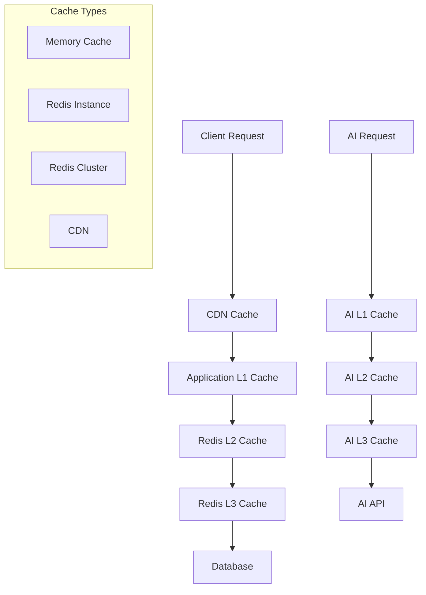

# VoteLens AI - Caching Strategy

## Executive Summary

This document outlines a comprehensive caching strategy for VoteLens AI, implementing multi-level caching with Redis, application-level caching, and AI response caching to optimize performance and reduce costs on Railway production deployment.

---

## Table of Contents

1. [Caching Architecture Overview](#caching-architecture-overview)
2. [Multi-Level Caching Strategy](#multi-level-caching-strategy)
3. [AI Response Caching](#ai-response-caching)
4. [Database Query Caching](#database-query-caching)
5. [Application-Level Caching](#application-level-caching)
6. [Cache Invalidation Strategies](#cache-invalidation-strategies)
7. [Cache Monitoring & Analytics](#cache-monitoring--analytics)
8. [Implementation Examples](#implementation-examples)

---

## Caching Architecture Overview

### 1. Cache Hierarchy



### 2. Cache Types & Use Cases

| Cache Type | Use Case | TTL | Size Limit | Priority |
|------------|----------|-----|------------|----------|
| L1 Memory | Hot data, session data | 5-15 min | 100MB | High |
| L2 Redis | Application cache, query results | 1-24 hours | 1GB | Medium |
| L3 Redis Cluster | Persistent cache, AI responses | 1-7 days | 10GB | Low |
| CDN | Static assets, API responses | 1-24 hours | Unlimited | High |

---

## Multi-Level Caching Strategy

### 1. Cache Hierarchy Implementation

```typescript
// src/services/cache-hierarchy.service.ts
export class CacheHierarchyService {
  private l1Cache: Map<string, CacheEntry>; // Memory
  private l2Cache: Redis; // Redis instance
  private l3Cache: RedisCluster; // Redis cluster
  private metrics: MetricsService;
  
  constructor() {
    this.l1Cache = new Map();
    this.l2Cache = new Redis(process.env.REDIS_URL);
    this.l3Cache = new RedisCluster([
      { host: 'redis-1.railway.app', port: 6379 },
      { host: 'redis-2.railway.app', port: 6379 },
      { host: 'redis-3.railway.app', port: 6379 }
    ]);
    this.metrics = new MetricsService();
    
    this.startCacheMaintenance();
  }
  
  async get(key: string): Promise<any> {
    const startTime = Date.now();
    
    try {
      // L1: Memory cache (fastest)
      let value = this.l1Cache.get(key);
      if (value && !this.isExpired(value)) {
        this.metrics.recordCacheHit('l1', Date.now() - startTime);
        return value.data;
      }
      
      // L2: Redis instance
      value = await this.l2Cache.get(key);
      if (value) {
        const parsed = JSON.parse(value);
        // Promote to L1
        this.setL1Cache(key, parsed, 300); // 5 minutes
        this.metrics.recordCacheHit('l2', Date.now() - startTime);
        return parsed;
      }
      
      // L3: Redis cluster
      value = await this.l3Cache.get(key);
      if (value) {
        const parsed = JSON.parse(value);
        // Promote to L2 and L1
        await this.setL2Cache(key, parsed, 3600); // 1 hour
        this.setL1Cache(key, parsed, 300);
        this.metrics.recordCacheHit('l3', Date.now() - startTime);
        return parsed;
      }
      
      this.metrics.recordCacheMiss(Date.now() - startTime);
      return null;
      
    } catch (error) {
      this.metrics.recordCacheError(error);
      return null;
    }
  }
  
  async set(key: string, value: any, ttl: number = 3600): Promise<void> {
    const serialized = JSON.stringify(value);
    const timestamp = Date.now();
    
    try {
      // Set in all levels
      this.setL1Cache(key, value, Math.min(ttl, 300)); // Max 5 min in L1
      await this.setL2Cache(key, value, Math.min(ttl, 3600)); // Max 1 hour in L2
      await this.setL3Cache(key, value, ttl); // Full TTL in L3
      
      this.metrics.recordCacheSet(key.length, serialized.length);
      
    } catch (error) {
      this.metrics.recordCacheError(error);
    }
  }
  
  private setL1Cache(key: string, value: any, ttl: number): void {
    // Implement LRU eviction
    if (this.l1Cache.size >= 1000) {
      this.evictLRU();
    }
    
    this.l1Cache.set(key, {
      data: value,
      timestamp: Date.now(),
      ttl: ttl * 1000,
      accessCount: 1,
      lastAccess: Date.now()
    });
  }
  
  private async setL2Cache(key: string, value: any, ttl: number): Promise<void> {
    await this.l2Cache.setex(key, ttl, JSON.stringify(value));
  }
  
  private async setL3Cache(key: string, value: any, ttl: number): Promise<void> {
    await this.l3Cache.set(key, JSON.stringify(value), 'EX', ttl);
  }
  
  private evictLRU(): void {
    let oldestKey = '';
    let oldestTime = Date.now();
    
    for (const [key, entry] of this.l1Cache.entries()) {
      if (entry.lastAccess < oldestTime) {
        oldestTime = entry.lastAccess;
        oldestKey = key;
      }
    }
    
    if (oldestKey) {
      this.l1Cache.delete(oldestKey);
    }
  }
  
  private isExpired(entry: CacheEntry): boolean {
    return Date.now() > entry.timestamp + entry.ttl;
  }
}
```

### 2. Cache Configuration

#### Redis Configuration
```typescript
// src/config/redis.config.ts
export const redisConfig = {
  // L2 Redis (instance)
  l2: {
    host: process.env.REDIS_L2_HOST || 'localhost',
    port: parseInt(process.env.REDIS_L2_PORT || '6379'),
    password: process.env.REDIS_L2_PASSWORD,
    db: 0,
    maxRetriesPerRequest: 3,
    retryDelayOnFailover: 100,
    connectTimeout: 10000,
    lazyConnect: true,
    keyPrefix: 'votelens:l2:',
    maxmemory: '512mb',
    maxmemoryPolicy: 'allkeys-lru'
  },
  
  // L3 Redis (cluster)
  l3: {
    nodes: [
      { host: process.env.REDIS_L3_NODE_1, port: 6379 },
      { host: process.env.REDIS_L3_NODE_2, port: 6379 },
      { host: process.env.REDIS_L3_NODE_3, port: 6379 }
    ],
    options: {
      password: process.env.REDIS_L3_PASSWORD,
      keyPrefix: 'votelens:l3:',
      maxRetriesPerRequest: 3,
      retryDelayOnFailover: 100,
      connectTimeout: 10000,
      lazyConnect: true,
      redisOptions: {
        maxmemory: '2gb',
        maxmemoryPolicy: 'allkeys-lru'
      }
    }
  }
};
```

---

## AI Response Caching

### 1. Enhanced AI Cache Service

```typescript
// src/services/enhanced-ai-cache.service.ts
export class EnhancedAICacheService {
  private cacheHierarchy: CacheHierarchyService;
  private similarityIndex: Map<string, number[]>; // For semantic caching
  private costTracker: CostTracker;
  
  constructor() {
    this.cacheHierarchy = new CacheHierarchyService();
    this.similarityIndex = new Map();
    this.costTracker = new CostTracker();
  }
  
  async get(request: AIRequest): Promise<AIResponse | null> {
    const startTime = Date.now();
    
    // Try exact match first
    const exactKey = this.generateExactKey(request);
    let response = await this.cacheHierarchy.get(exactKey);
    
    if (response) {
      this.recordCacheHit('exact', Date.now() - startTime);
      return { ...response, isCached: true, cacheType: 'exact' };
    }
    
    // Try semantic match
    const semanticKey = this.generateSemanticKey(request);
    response = await this.cacheHierarchy.get(semanticKey);
    
    if (response) {
      this.recordCacheHit('semantic', Date.now() - startTime);
      return { ...response, isCached: true, cacheType: 'semantic' };
    }
    
    // Try similarity search
    response = await this.findSimilarResponse(request);
    if (response) {
      this.recordCacheHit('similar', Date.now() - startTime);
      return { ...response, isCached: true, cacheType: 'similar' };
    }
    
    this.recordCacheMiss(Date.now() - startTime);
    return null;
  }
  
  async set(request: AIRequest, response: AIResponse): Promise<void> {
    const ttl = this.calculateAdaptiveTTL(request, response);
    
    // Store exact match
    const exactKey = this.generateExactKey(request);
    await this.cacheHierarchy.set(exactKey, response, ttl);
    
    // Store semantic match
    const semanticKey = this.generateSemanticKey(request);
    await this.cacheHierarchy.set(semanticKey, response, ttl * 2);
    
    // Update similarity index
    this.updateSimilarityIndex(request, response);
    
    // Track cost savings
    this.costTracker.recordCacheHit(response.tokensUsed);
  }
  
  private generateExactKey(request: AIRequest): string {
    const keyData = {
      query: request.query.trim().toLowerCase(),
      model: request.model || 'default',
      temperature: request.temperature || 0.7,
      electionId: request.electionId,
      constituencyId: request.constituencyId
    };
    
    return `ai:exact:${crypto.createHash('sha256').update(JSON.stringify(keyData)).digest('hex')}`;
  }
  
  private generateSemanticKey(request: AIRequest): string {
    // Extract key concepts from query
    const concepts = this.extractConcepts(request.query);
    return `ai:semantic:${concepts.join(':')}:${request.model || 'default'}`;
  }
  
  private extractConcepts(query: string): string[] {
    // Simple concept extraction (can be enhanced with NLP)
    const words = query.toLowerCase()
      .replace(/[^\w\s]/g, '')
      .split(/\s+/)
      .filter(word => word.length > 3)
      .filter(word => !this.isStopWord(word));
    
    return [...new Set(words)].slice(0, 5); // Top 5 concepts
  }
  
  private isStopWord(word: string): boolean {
    const stopWords = ['the', 'and', 'for', 'are', 'with', 'this', 'that', 'from', 'have', 'they', 'been'];
    return stopWords.includes(word);
  }
  
  private calculateAdaptiveTTL(request: AIRequest, response: AIResponse): number {
    let baseTTL = 86400; // 24 hours
    
    // Adjust based on query complexity
    if (request.query.length > 500) {
      baseTTL *= 2; // Longer queries get longer TTL
    }
    
    // Adjust based on response confidence
    if (response.confidence && response.confidence > 0.9) {
      baseTTL *= 1.5; // High confidence gets longer TTL
    }
    
    // Adjust based on election recency
    if (request.electionId) {
      const electionAge = this.getElectionAge(request.electionId);
      if (electionAge < 7) { // Recent election
        baseTTL *= 0.5; // Shorter TTL for recent data
      }
    }
    
    return Math.min(baseTTL, 604800); // Max 7 days
  }
  
  private async findSimilarResponse(request: AIRequest): Promise<AIResponse | null> {
    const concepts = this.extractConcepts(request.query);
    const candidateKeys: string[] = [];
    
    for (const concept of concepts) {
      const keys = this.similarityIndex.get(concept) || [];
      candidateKeys.push(...keys);
    }
    
    // Find most similar response
    let bestMatch: AIResponse | null = null;
    let bestSimilarity = 0;
    
    for (const key of candidateKeys) {
      const response = await this.cacheHierarchy.get(key);
      if (response) {
        const similarity = this.calculateSimilarity(request.query, response.originalQuery);
        if (similarity > bestSimilarity && similarity > 0.8) {
          bestSimilarity = similarity;
          bestMatch = response;
        }
      }
    }
    
    return bestMatch;
  }
  
  private calculateSimilarity(query1: string, query2: string): number {
    const words1 = new Set(this.extractConcepts(query1));
    const words2 = new Set(this.extractConcepts(query2));
    
    const intersection = new Set([...words1].filter(x => words2.has(x)));
    const union = new Set([...words1, ...words2]);
    
    return intersection.size / union.size; // Jaccard similarity
  }
}
```

### 2. AI Cache Warming

```typescript
// src/services/ai-cache-warming.service.ts
export class AICacheWarmingService {
  private aiService: AIService;
  private cacheService: EnhancedAICacheService;
  private analyticsService: AnalyticsService;
  
  constructor() {
    this.aiService = getAIService();
    this.cacheService = new EnhancedAICacheService();
    this.analyticsService = new AnalyticsService();
  }
  
  async warmCache(): Promise<WarmingReport> {
    const report: WarmingReport = {
      startTime: new Date(),
      queriesWarmed: 0,
      errors: 0,
      costSavings: 0,
      endTime: null
    };
    
    try {
      // Get top queries from analytics
      const topQueries = await this.analyticsService.getTopQueries(100);
      
      // Group by type for efficient processing
      const queryGroups = this.groupQueriesByType(topQueries);
      
      // Warm each group
      for (const [type, queries] of queryGroups.entries()) {
        await this.warmQueryGroup(type, queries, report);
      }
      
      // Warm election-specific queries
      await this.warmElectionQueries(report);
      
      // Warm analytical queries
      await this.warmAnalyticalQueries(report);
      
    } catch (error) {
      console.error('Cache warming failed:', error);
      report.errors++;
    } finally {
      report.endTime = new Date();
    }
    
    return report;
  }
  
  private async warmQueryGroup(
    type: string, 
    queries: any[], 
    report: WarmingReport
  ): Promise<void> {
    const batchSize = 5; // Process 5 queries at a time
    
    for (let i = 0; i < queries.length; i += batchSize) {
      const batch = queries.slice(i, i + batchSize);
      
      const promises = batch.map(async (query) => {
        try {
          const request: AIRequest = {
            query: query.text,
            model: 'gemini-pro',
            temperature: 0.7
          };
          
          // Check if already cached
          const cached = await this.cacheService.get(request);
          if (!cached) {
            const response = await this.aiService.generateText(request);
            await this.cacheService.set(request, response);
            report.queriesWarmed++;
            report.costSavings += this.calculateSavings(response);
          }
          
        } catch (error) {
          console.error(`Failed to warm query: ${query.text}`, error);
          report.errors++;
        }
      });
      
      await Promise.allSettled(promises);
      
      // Delay between batches to avoid rate limiting
      await new Promise(resolve => setTimeout(resolve, 1000));
    }
  }
  
  private async warmElectionQueries(report: WarmingReport): Promise<void> {
    const activeElections = await this.getActiveElections();
    
    for (const election of activeElections) {
      const commonQueries = [
        `What are the key trends in ${election.name}?`,
        `Who are the leading candidates in ${election.name}?`,
        `What is the voter turnout for ${election.name}?`,
        `What are the demographics of ${election.name}?`,
        `What are the predictions for ${election.name}?`
      ];
      
      for (const queryText of commonQueries) {
        const request: AIRequest = {
          query: queryText,
          electionId: election.id,
          model: 'gemini-pro',
          temperature: 0.7
        };
        
        const cached = await this.cacheService.get(request);
        if (!cached) {
          try {
            const response = await this.aiService.generateText(request);
            await this.cacheService.set(request, response);
            report.queriesWarmed++;
          } catch (error) {
            report.errors++;
          }
        }
      }
    }
  }
  
  private calculateSavings(response: AIResponse): number {
    const avgCostPerToken = 0.000001; // $0.000001 per token
    return response.tokensUsed * avgCostPerToken;
  }
}
```

---

## Database Query Caching

### 1. Query Result Caching

```typescript
// src/services/query-cache.service.ts
export class QueryCacheService {
  private cacheHierarchy: CacheHierarchyService;
  private queryAnalyzer: QueryAnalyzer;
  
  constructor() {
    this.cacheHierarchy = new CacheHierarchyService();
    this.queryAnalyzer = new QueryAnalyzer();
  }
  
  async cacheQuery<T>(
    queryKey: string,
    queryFn: () => Promise<T>,
    options: CacheOptions = {}
  ): Promise<T> {
    const {
      ttl = 300,
      tags = [],
      invalidateOn = [],
      priority = 'medium'
    } = options;
    
    // Check cache first
    const cached = await this.cacheHierarchy.get(queryKey);
    if (cached) {
      return cached;
    }
    
    // Execute query
    const startTime = Date.now();
    const result = await queryFn();
    const duration = Date.now() - startTime;
    
    // Cache the result
    await this.cacheHierarchy.set(queryKey, result, ttl);
    
    // Store metadata for cache management
    await this.storeCacheMetadata(queryKey, {
      ttl,
      tags,
      invalidateOn,
      priority,
      duration,
      timestamp: new Date()
    });
    
    // Track query performance
    this.queryAnalyzer.recordQuery(queryKey, duration);
    
    return result;
  }
  
  async invalidateByTags(tags: string[]): Promise<void> {
    for (const tag of tags) {
      const keys = await this.getKeysByTag(tag);
      for (const key of keys) {
        await this.cacheHierarchy.delete(key);
      }
    }
  }
  
  async invalidateByPattern(pattern: string): Promise<void> {
    const keys = await this.getKeysByPattern(pattern);
    for (const key of keys) {
      await this.cacheHierarchy.delete(key);
    }
  }
  
  // Predefined cache keys for common queries
  static CACHE_KEYS = {
    ELECTION_LIST: (page: number, filters: any) => 
      `elections:list:${page}:${JSON.stringify(filters)}`,
    
    ELECTION_DETAIL: (id: string) => `elections:detail:${id}`,
    
    CONSTITUENCY_LIST: (electionId: string) => 
      `constituencies:list:${electionId}`,
    
    RESULTS_SUMMARY: (electionId: string) => 
      `results:summary:${electionId}`,
    
    ANALYTICS_DASHBOARD: (electionId: string) => 
      `analytics:dashboard:${electionId}`,
    
    USER_PROFILE: (userId: string) => `users:profile:${userId}`,
    
    USER_PERMISSIONS: (userId: string) => `users:permissions:${userId}`
  };
}
```

### 2. Intelligent Cache Invalidation

```typescript
// src/services/cache-invalidation.service.ts
export class CacheInvalidationService {
  private cacheService: QueryCacheService;
  private eventBus: EventBus;
  
  constructor() {
    this.cacheService = new QueryCacheService();
    this.eventBus = new EventBus();
    this.setupInvalidationListeners();
  }
  
  private setupInvalidationListeners(): void {
    // Election updates
    this.eventBus.on('election.updated', async (event: ElectionUpdatedEvent) => {
      await this.invalidateElectionCache(event.electionId);
    });
    
    // Result updates
    this.eventBus.on('result.updated', async (event: ResultUpdatedEvent) => {
      await this.invalidateResultCache(event.electionId, event.constituencyId);
    });
    
    // User updates
    this.eventBus.on('user.updated', async (event: UserUpdatedEvent) => {
      await this.invalidateUserCache(event.userId);
    });
    
    // Dataset uploads
    this.eventBus.on('dataset.uploaded', async (event: DatasetUploadedEvent) => {
      await this.invalidateDatasetCache(event.electionId);
    });
  }
  
  private async invalidateElectionCache(electionId: string): Promise<void> {
    // Invalidate all election-related caches
    await Promise.all([
      this.cacheService.invalidateByPattern(`elections:*:${electionId}*`),
      this.cacheService.invalidateByPattern(`constituencies:*:${electionId}*`),
      this.cacheService.invalidateByPattern(`results:*:${electionId}*`),
      this.cacheService.invalidateByPattern(`analytics:*:${electionId}*`),
      this.cacheService.invalidateByTags(['election', electionId])
    ]);
  }
  
  private async invalidateResultCache(
    electionId: string, 
    constituencyId?: string
  ): Promise<void> {
    const patterns = [
      `results:*:${electionId}*`,
      `analytics:*:${electionId}*`
    ];
    
    if (constituencyId) {
      patterns.push(`results:*:${constituencyId}*`);
    }
    
    await Promise.all(
      patterns.map(pattern => this.cacheService.invalidateByPattern(pattern))
    );
  }
  
  private async invalidateUserCache(userId: string): Promise<void> {
    await Promise.all([
      this.cacheService.invalidateByPattern(`users:*:${userId}*`),
      this.cacheService.invalidateByTags(['user', userId])
    ]);
  }
  
  private async invalidateDatasetCache(electionId: string): Promise<void> {
    await Promise.all([
      this.cacheService.invalidateByPattern(`datasets:*:${electionId}*`),
      this.cacheService.invalidateByPattern(`analytics:*:${electionId}*`),
      this.cacheService.invalidateByTags(['dataset', electionId])
    ]);
  }
  
  // Scheduled cache cleanup
  async performScheduledCleanup(): Promise<void> {
    // Clean up expired cache entries
    await this.cleanupExpiredEntries();
    
    // Clean up low-priority entries
    await this.cleanupLowPriorityEntries();
    
    // Optimize cache structure
    await this.optimizeCacheStructure();
  }
  
  private async cleanupExpiredEntries(): Promise<void> {
    const expiredKeys = await this.getExpiredKeys();
    
    for (const key of expiredKeys) {
      await this.cacheService.delete(key);
    }
  }
  
  private async cleanupLowPriorityEntries(): Promise<void> {
    // Get cache usage statistics
    const stats = await this.getCacheStats();
    
    // If cache is over 80% full, remove low-priority entries
    if (stats.memoryUsage > 0.8) {
      const lowPriorityKeys = await this.getLowPriorityKeys();
      
      for (const key of lowPriorityKeys.slice(0, 100)) { // Remove 100 entries
        await this.cacheService.delete(key);
      }
    }
  }
}
```

---

## Application-Level Caching

### 1. HTTP Response Caching

```typescript
// src/middleware/http-cache.middleware.ts
export function httpCacheMiddleware(options: HTTPCacheOptions = {}) {
  const {
    ttl = 300, // 5 minutes default
    vary = ['Accept', 'Accept-Encoding'],
    skipCache = false,
    keyGenerator = defaultKeyGenerator
  } = options;
  
  return async (req: Request, res: Response, next: NextFunction) => {
    if (skipCache || req.method !== 'GET') {
      return next();
    }
    
    const cacheKey = keyGenerator(req);
    const cacheService = new QueryCacheService();
    
    try {
      // Check cache
      const cached = await cacheService.get(cacheKey);
      
      if (cached) {
        // Set cache headers
        res.set('X-Cache', 'HIT');
        res.set('Cache-Control', `public, max-age=${ttl}`);
        
        // Set Vary header
        if (vary.length > 0) {
          res.set('Vary', vary.join(', '));
        }
        
        return res.json(cached);
      }
      
      // Intercept response to cache it
      const originalJson = res.json.bind(res);
      res.json = (data: any) => {
        // Cache the response
        cacheService.set(cacheKey, data, ttl).catch(error => {
          console.error('Failed to cache response:', error);
        });
        
        // Set cache headers
        res.set('X-Cache', 'MISS');
        res.set('Cache-Control', `public, max-age=${ttl}`);
        
        if (vary.length > 0) {
          res.set('Vary', vary.join(', '));
        }
        
        return originalJson(data);
      };
      
      next();
      
    } catch (error) {
      console.error('Cache middleware error:', error);
      next();
    }
  };
}

function defaultKeyGenerator(req: Request): string {
  const url = req.originalUrl || req.url;
  const query = new URLSearchParams(req.query as any).toString();
  return `http:${req.method}:${url}${query ? `?${query}` : ''}`;
}

// Usage examples
export const cacheMiddleware = {
  // Short cache for frequently changing data
  short: httpCacheMiddleware({ ttl: 60 }),
  
  // Medium cache for semi-static data
  medium: httpCacheMiddleware({ ttl: 300 }),
  
  // Long cache for static data
  long: httpCacheMiddleware({ ttl: 3600 }),
  
  // Election-specific cache
  election: httpCacheMiddleware({ 
    ttl: 600,
    keyGenerator: (req) => `election:${req.params.id}:${req.originalUrl}`
  }),
  
  // User-specific cache (vary by user)
  user: httpCacheMiddleware({
    ttl: 180,
    vary: ['Accept', 'Accept-Encoding', 'Authorization'],
    keyGenerator: (req) => {
      const userId = (req as any).user?.id || 'anonymous';
      return `user:${userId}:${req.originalUrl}`;
    }
  })
};
```

### 2. Static Asset Caching

```typescript
// src/middleware/static-cache.middleware.ts
export function staticCacheMiddleware(options: StaticCacheOptions = {}) {
  const {
    maxAge = 31536000, // 1 year default
    immutable = false,
    etag = true,
    lastModified = true
  } = options;
  
  return (req: Request, res: Response, next: NextFunction) => {
    // Set cache control header
    let cacheControl = `public, max-age=${maxAge}`;
    if (immutable) {
      cacheControl += ', immutable';
    }
    res.set('Cache-Control', cacheControl);
    
    // Set ETag if enabled
    if (etag && req.url) {
      const fileHash = crypto.createHash('md5')
        .update(req.url + process.env.BUILD_VERSION || '')
        .digest('hex');
      res.set('ETag', `"${fileHash}"`);
      
      // Check If-None-Match header
      const ifNoneMatch = req.get('If-None-Match');
      if (ifNoneMatch === `"${fileHash}"`) {
        return res.status(304).end();
      }
    }
    
    // Set Last-Modified if enabled
    if (lastModified) {
      const lastModified = new Date().toUTCString();
      res.set('Last-Modified', lastModified);
      
      // Check If-Modified-Since header
      const ifModifiedSince = req.get('If-Modified-Since');
      if (ifModifiedSince === lastModified) {
        return res.status(304).end();
      }
    }
    
    next();
  };
}

// Asset-specific middleware
export const assetCache = {
  // Images and fonts (long cache)
  images: staticCacheMiddleware({ maxAge: 31536000, immutable: true }),
  
  // CSS and JS (versioned)
  scripts: staticCacheMiddleware({ maxAge: 31536000, immutable: true }),
  
  // API responses (shorter cache)
  api: httpCacheMiddleware({ ttl: 300 }),
  
  // Static pages
  pages: httpCacheMiddleware({ ttl: 600 })
};
```

---

## Cache Invalidation Strategies

### 1. Tag-Based Invalidation

```typescript
// src/services/tag-based-cache.service.ts
export class TagBasedCacheService {
  private cacheService: QueryCacheService;
  private tagIndex: Map<string, Set<string>>;
  
  constructor() {
    this.cacheService = new QueryCacheService();
    this.tagIndex = new Map();
  }
  
  async setWithTags(
    key: string, 
    value: any, 
    ttl: number, 
    tags: string[]
  ): Promise<void> {
    // Store the value
    await this.cacheService.set(key, value, ttl);
    
    // Update tag index
    for (const tag of tags) {
      if (!this.tagIndex.has(tag)) {
        this.tagIndex.set(tag, new Set());
      }
      this.tagIndex.get(tag)!.add(key);
    }
    
    // Store tag metadata
    await this.storeTagMetadata(key, tags);
  }
  
  async invalidateByTag(tag: string): Promise<void> {
    const keys = this.tagIndex.get(tag);
    if (!keys) return;
    
    // Delete all keys with this tag
    const deletePromises = Array.from(keys).map(key => 
      this.cacheService.delete(key)
    );
    
    await Promise.all(deletePromises);
    
    // Clear tag index
    this.tagIndex.delete(tag);
  }
  
  async invalidateByTags(tags: string[]): Promise<void> {
    const allKeys = new Set<string>();
    
    for (const tag of tags) {
      const keys = this.tagIndex.get(tag);
      if (keys) {
        keys.forEach(key => allKeys.add(key));
      }
    }
    
    const deletePromises = Array.from(allKeys).map(key => 
      this.cacheService.delete(key)
    );
    
    await Promise.all(deletePromises);
    
    // Clear tag indices
    for (const tag of tags) {
      this.tagIndex.delete(tag);
    }
  }
  
  // Predefined tags
  static TAGS = {
    ELECTION: 'election',
    USER: 'user',
    ANALYTICS: 'analytics',
    RESULTS: 'results',
    CONSTITUENCY: 'constituency',
    DATASET: 'dataset',
    ADMIN: 'admin'
  };
}
```

### 2. Event-Driven Invalidation

```typescript
// src/services/event-driven-cache.service.ts
export class EventDrivenCacheService {
  private eventBus: EventBus;
  private invalidationRules: Map<string, InvalidationRule[]>;
  
  constructor() {
    this.eventBus = new EventBus();
    this.invalidationRules = new Map();
    this.setupInvalidationRules();
  }
  
  private setupInvalidationRules(): void {
    // Election events
    this.addInvalidationRule('election.created', [
      { pattern: 'elections:list:*', ttl: 0 },
      { pattern: 'analytics:dashboard:*', ttl: 0 }
    ]);
    
    this.addInvalidationRule('election.updated', [
      { pattern: `elections:detail:{electionId}`, ttl: 0 },
      { pattern: `elections:list:*`, ttl: 0 },
      { pattern: `analytics:*:{electionId}`, ttl: 0 }
    ]);
    
    this.addInvalidationRule('election.deleted', [
      { pattern: `elections:*:{electionId}`, ttl: 0 },
      { pattern: `*:*:{electionId}`, ttl: 0 }
    ]);
    
    // Result events
    this.addInvalidationRule('result.created', [
      { pattern: `results:summary:{electionId}`, ttl: 0 },
      { pattern: `analytics:*:{electionId}`, ttl: 0 }
    ]);
    
    this.addInvalidationRule('result.updated', [
      { pattern: `results:*:{electionId}`, ttl: 0 },
      { pattern: `analytics:*:{electionId}`, ttl: 0 }
    ]);
    
    // User events
    this.addInvalidationRule('user.updated', [
      { pattern: `users:*:{userId}`, ttl: 0 },
      { pattern: `users:permissions:{userId}`, ttl: 0 }
    ]);
  }
  
  private addInvalidationRule(event: string, rules: InvalidationRule[]): void {
    this.invalidationRules.set(event, rules);
    
    this.eventBus.on(event, async (eventData: any) => {
      await this.applyInvalidationRules(event, eventData);
    });
  }
  
  private async applyInvalidationRules(
    event: string, 
    eventData: any
  ): Promise<void> {
    const rules = this.invalidationRules.get(event);
    if (!rules) return;
    
    const cacheService = new QueryCacheService();
    
    for (const rule of rules) {
      const pattern = this.substitutePattern(rule.pattern, eventData);
      
      if (rule.ttl === 0) {
        // Invalidate immediately
        await cacheService.invalidateByPattern(pattern);
      } else {
        // Update TTL
        await cacheService.updateTTL(pattern, rule.ttl);
      }
    }
  }
  
  private substitutePattern(pattern: string, eventData: any): string {
    return pattern.replace(/{(\w+)}/g, (match, key) => {
      return eventData[key] || match;
    });
  }
}
```

---

## Cache Monitoring & Analytics

### 1. Cache Performance Monitoring

```typescript
// src/services/cache-monitoring.service.ts
export class CacheMonitoringService {
  private metrics: MetricsService;
  private alertManager: AlertManager;
  
  constructor() {
    this.metrics = new MetricsService();
    this.alertManager = new AlertManager();
    this.startMonitoring();
  }
  
  private startMonitoring(): void {
    // Monitor cache performance every minute
    setInterval(async () => {
      await this.collectCacheMetrics();
    }, 60000);
    
    // Generate hourly reports
    setInterval(async () => {
      await this.generateHourlyReport();
    }, 3600000);
  }
  
  private async collectCacheMetrics(): Promise<void> {
    const cacheService = new QueryCacheService();
    const stats = await cacheService.getStats();
    
    // Record metrics
    this.metrics.recordGauge('cache_hit_rate', stats.hitRate);
    this.metrics.recordGauge('cache_size', stats.size);
    this.metrics.recordGauge('cache_memory_usage', stats.memoryUsage);
    this.metrics.recordCounter('cache_hits', stats.hits);
    this.metrics.recordCounter('cache_misses', stats.misses);
    
    // Check for alerts
    if (stats.hitRate < 0.7) { // Hit rate below 70%
      await this.alertManager.sendAlert({
        type: 'low_cache_hit_rate',
        value: stats.hitRate,
        threshold: 0.7
      });
    }
    
    if (stats.memoryUsage > 0.9) { // Memory usage above 90%
      await this.alertManager.sendAlert({
        type: 'high_cache_memory_usage',
        value: stats.memoryUsage,
        threshold: 0.9
      });
    }
  }
  
  async generateHourlyReport(): Promise<CacheReport> {
    const cacheService = new QueryCacheService();
    const stats = await cacheService.getDetailedStats();
    
    const report: CacheReport = {
      timestamp: new Date(),
      period: '1h',
      hitRate: stats.hitRate,
      totalRequests: stats.hits + stats.misses,
      averageResponseTime: stats.avgResponseTime,
      memoryUsage: stats.memoryUsage,
      topHitKeys: stats.topHitKeys.slice(0, 10),
      topMissKeys: stats.topMissKeys.slice(0, 10),
      costSavings: this.calculateCostSavings(stats.hits),
      recommendations: this.generateRecommendations(stats)
    };
    
    // Send report to monitoring service
    await this.sendReport(report);
    
    return report;
  }
  
  private calculateCostSavings(hits: number): number {
    // Estimate cost savings from cache hits
    const avgQueryCost = 0.001; // $0.001 per query
    return hits * avgQueryCost;
  }
  
  private generateRecommendations(stats: CacheStats): string[] {
    const recommendations: string[] = [];
    
    if (stats.hitRate < 0.7) {
      recommendations.push('Consider increasing cache TTL for frequently accessed data');
      recommendations.push('Review cache key generation for better hit rates');
    }
    
    if (stats.memoryUsage > 0.8) {
      recommendations.push('Consider increasing cache memory allocation');
      recommendations.push('Implement more aggressive cache eviction policies');
    }
    
    if (stats.avgResponseTime > 100) {
      recommendations.push('Consider using faster cache storage');
      recommendations.push('Optimize cache key serialization');
    }
    
    return recommendations;
  }
}
```

### 2. Cache Analytics Dashboard

```typescript
// src/services/cache-analytics.service.ts
export class CacheAnalyticsService {
  private cacheService: QueryCacheService;
  private metrics: MetricsService;
  
  constructor() {
    this.cacheService = new QueryCacheService();
    this.metrics = new MetricsService();
  }
  
  async getDashboardData(): Promise<CacheDashboard> {
    const [
      overview,
      performance,
      usage,
      trends
    ] = await Promise.all([
      this.getOverviewStats(),
      this.getPerformanceMetrics(),
      this.getUsageAnalytics(),
      this.getTrendData()
    ]);
    
    return {
      overview,
      performance,
      usage,
      trends,
      timestamp: new Date()
    };
  }
  
  private async getOverviewStats(): Promise<OverviewStats> {
    const stats = await this.cacheService.getStats();
    
    return {
      hitRate: stats.hitRate,
      totalRequests: stats.hits + stats.misses,
      cacheSize: stats.size,
      memoryUsage: stats.memoryUsage,
      costSavings: this.calculateCostSavings(stats.hits)
    };
  }
  
  private async getPerformanceMetrics(): Promise<PerformanceMetrics> {
    const stats = await this.cacheService.getPerformanceStats();
    
    return {
      averageResponseTime: stats.avgResponseTime,
      p95ResponseTime: stats.p95ResponseTime,
      p99ResponseTime: stats.p99ResponseTime,
      throughput: stats.throughput,
      errorRate: stats.errorRate
    };
  }
  
  private async getUsageAnalytics(): Promise<UsageAnalytics> {
    const stats = await this.cacheService.getUsageStats();
    
    return {
      topHitKeys: stats.topHitKeys,
      topMissKeys: stats.topMissKeys,
      keyDistribution: stats.keyDistribution,
      ttlDistribution: stats.ttlDistribution,
      tagUsage: stats.tagUsage
    };
  }
  
  private async getTrendData(): Promise<TrendData> {
    const trends = await this.cacheService.getTrendData('24h');
    
    return {
      hitRateTrend: trends.hitRate,
      requestVolumeTrend: trends.requestVolume,
      memoryUsageTrend: trends.memoryUsage,
      responseTimeTrend: trends.responseTime
    };
  }
}
```

---

## Implementation Examples

### 1. Election Service with Caching

```typescript
// src/services/election-cache.service.ts
export class ElectionServiceWithCache {
  private cacheService: QueryCacheService;
  private electionRepository: ElectionRepository;
  private invalidationService: CacheInvalidationService;
  
  constructor() {
    this.cacheService = new QueryCacheService();
    this.electionRepository = new ElectionRepository();
    this.invalidationService = new CacheInvalidationService();
  }
  
  async getElections(
    page: number = 1,
    filters: ElectionFilters = {},
    options: CacheOptions = {}
  ): Promise<PaginatedResult<Election>> {
    const cacheKey = QueryCacheService.CACHE_KEYS.ELECTION_LIST(page, filters);
    
    return this.cacheService.cacheQuery(
      cacheKey,
      () => this.electionRepository.findMany(page, filters),
      {
        ttl: 600, // 10 minutes
        tags: [TagBasedCacheService.TAGS.ELECTION],
        ...options
      }
    );
  }
  
  async getElection(id: string): Promise<Election | null> {
    const cacheKey = QueryCacheService.CACHE_KEYS.ELECTION_DETAIL(id);
    
    return this.cacheService.cacheQuery(
      cacheKey,
      () => this.electionRepository.findById(id),
      {
        ttl: 1800, // 30 minutes
        tags: [TagBasedCacheService.TAGS.ELECTION, id]
      }
    );
  }
  
  async createElection(data: CreateElectionData): Promise<Election> {
    const election = await this.electionRepository.create(data);
    
    // Invalidate caches
    await this.invalidationService.invalidateElectionCache(election.id);
    
    return election;
  }
  
  async updateElection(
    id: string, 
    data: UpdateElectionData
  ): Promise<Election> {
    const election = await this.electionRepository.update(id, data);
    
    // Invalidate caches
    await this.invalidationService.invalidateElectionCache(id);
    
    return election;
  }
}
```

### 2. Analytics Service with Caching

```typescript
// src/services/analytics-cache.service.ts
export class AnalyticsServiceWithCache {
  private cacheService: QueryCacheService;
  private analyticsRepository: AnalyticsRepository;
  
  constructor() {
    this.cacheService = new QueryCacheService();
    this.analyticsRepository = new AnalyticsRepository();
  }
  
  async getElectionAnalytics(electionId: string): Promise<ElectionAnalytics> {
    const cacheKey = QueryCacheService.CACHE_KEYS.ANALYTICS_DASHBOARD(electionId);
    
    return this.cacheService.cacheQuery(
      cacheKey,
      () => this.analyticsRepository.getElectionAnalytics(electionId),
      {
        ttl: 900, // 15 minutes
        tags: [
          TagBasedCacheService.TAGS.ANALYTICS,
          TagBasedCacheService.TAGS.ELECTION,
          electionId
        ]
      }
    );
  }
  
  async getResultsSummary(electionId: string): Promise<ResultsSummary> {
    const cacheKey = QueryCacheService.CACHE_KEYS.RESULTS_SUMMARY(electionId);
    
    return this.cacheService.cacheQuery(
      cacheKey,
      () => this.analyticsRepository.getResultsSummary(electionId),
      {
        ttl: 300, // 5 minutes
        tags: [
          TagBasedCacheService.TAGS.RESULTS,
          TagBasedCacheService.TAGS.ELECTION,
          electionId
        ]
      }
    );
  }
}
```

---

## Implementation Checklist

### Phase 1: Basic Caching (Week 1)
- [ ] Set up Redis cluster
- [ ] Implement cache hierarchy
- [ ] Add basic HTTP caching
- [ ] Set up cache monitoring
- [ ] Test cache performance

### Phase 2: AI Caching (Week 2)
- [ ] Implement AI response caching
- [ ] Add semantic caching
- [ ] Set up cache warming
- [ ] Implement similarity matching
- [ ] Monitor AI cache performance

### Phase 3: Advanced Caching (Week 3)
- [ ] Implement tag-based invalidation
- [ ] Set up event-driven invalidation
- [ ] Add query result caching
- [ ] Implement cache analytics
- [ ] Optimize cache strategies

### Phase 4: Production (Week 4)
- [ ] Deploy cache configuration
- [ ] Set up monitoring alerts
- [ ] Load test cache performance
- [ ] Document cache strategies
- [ ] Train team on cache management

---

## Performance Targets

### Cache Performance
- **Hit Rate**: >85% for L1, >70% for L2, >50% for L3
- **Response Time**: <10ms for L1, <50ms for L2, <100ms for L3
- **Memory Usage**: <80% of allocated memory
- **Eviction Rate**: <5% per hour

### AI Cache Performance
- **Cache Hit Rate**: >60% for exact matches
- **Semantic Hit Rate**: >30% for similar queries
- **Cost Savings**: >40% reduction in AI API costs
- **Response Time**: <100ms for cached responses

### Application Cache Performance
- **HTTP Cache Hit Rate**: >70%
- **Static Asset Cache**: >95%
- **API Response Caching**: >60%
- **Database Query Caching**: >50%

---

## Conclusion

This comprehensive caching strategy provides VoteLens AI with multi-level caching to optimize performance, reduce costs, and improve user experience. The combination of memory caching, Redis clustering, AI response caching, and intelligent invalidation ensures optimal performance across all application layers.

Regular monitoring and optimization of cache strategies are essential for maintaining high performance as the application scales. The analytics and monitoring tools provided help ensure the caching strategy continues to meet performance targets.
