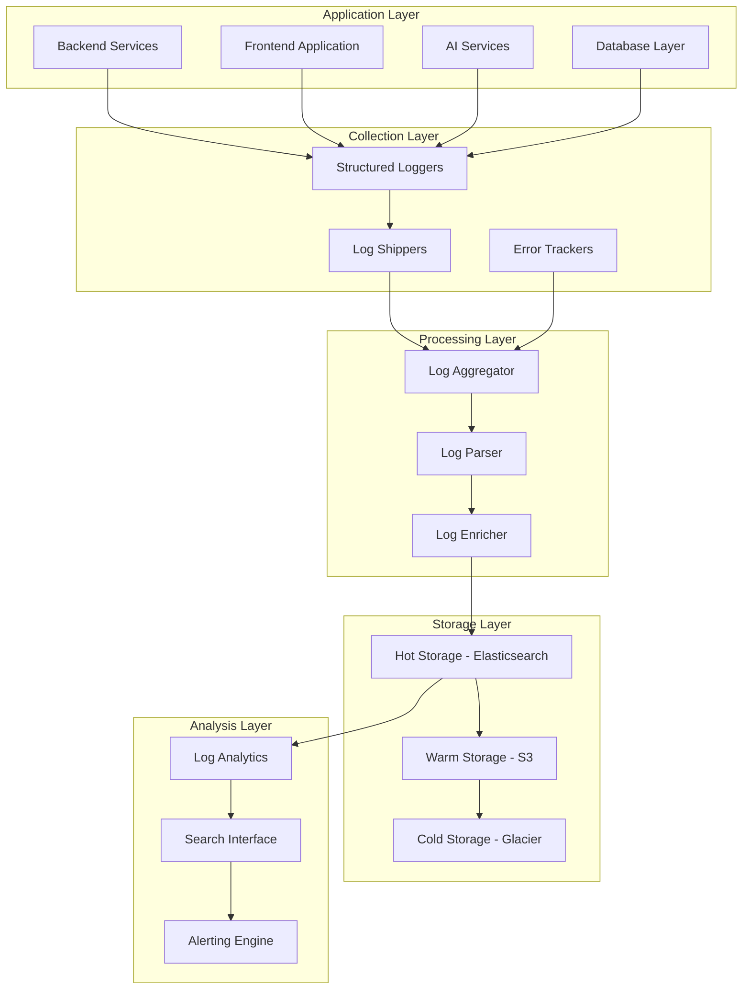

# VoteLens AI - Production Logging Strategy

## Executive Summary

This document outlines a comprehensive logging strategy for VoteLens AI production deployment on Railway, covering log collection, aggregation, analysis, and retention policies for effective monitoring and troubleshooting.

---

## Table of Contents

1. [Logging Architecture](#logging-architecture)
2. [Log Collection Strategy](#log-collection-strategy)
3. [Log Format & Standards](#log-format--standards)
4. [Log Aggregation](#log-aggregation)
5. [Log Analysis & Search](#log-analysis--search)
6. [Log Retention Policies](#log-retention-policies)
7. [Security & Compliance](#security--compliance)
8. [Implementation Guide](#implementation-guide)

---

## Logging Architecture

### 1. Logging Stack Architecture



### 2. Log Sources & Types

| Source | Log Type | Format | Volume | Retention |
|--------|---------|--------|--------|-----------|
| **Backend API** | Application logs, Access logs, Error logs | JSON | 30 days |
| **Frontend** | Client errors, Performance metrics, User interactions | JSON | 30 days |
| **AI Service** | API calls, Response times, Cost tracking | JSON | 90 days |
| **Database** | Query logs, Slow queries, Connection logs | JSON | 30 days |
| **Railway** | Platform logs, Deployment logs, System logs | Text | 90 days |
| **Infrastructure** | System metrics, Health checks, Resource usage | JSON | 30 days |

---

## Log Collection Strategy

### 1. Structured Logging Implementation

```typescript
// src/logging/structured-logger.ts
export class StructuredLogger {
  private logger: Logger;
  private context: LogContext;
  private logBuffer: LogEntry[] = [];
  private bufferSize = 100;
  private flushInterval = 5000; // 5 seconds
  
  constructor(serviceName: string, version: string) {
    this.logger = winston.createLogger({
      level: process.env.LOG_LEVEL || 'info',
      format: winston.format.combine(
        winston.format.timestamp(),
        winston.format.errors({ stack: true }),
        winston.format.json()
      ),
      transports: [
        new winston.transports.Console(),
        new winston.transports.File({
          filename: `logs/${serviceName}.log`,
          maxsize: 100 * 1024 * 1024, // 100MB
          maxFiles: 10,
          tailable: true
        })
      ]
    });
    
    this.context = {
      service: serviceName,
      version,
      environment: process.env.NODE_ENV || 'development',
      instanceId: this.getInstanceId(),
      hostname: os.hostname(),
      pid: process.pid
    };
    
    this.startLogBuffering();
  }
  
  private startLogBuffering(): void {
    setInterval(() => {
      this.flushLogBuffer();
    }, this.flushInterval);
  }
  
  private getInstanceId(): string {
    // Generate unique instance ID
    return process.env.INSTANCE_ID || crypto.randomUUID();
  }
  
  info(message: string, metadata?: any): void {
    this.log('info', message, metadata);
  }
  
  warn(message: string, metadata?: any): void {
    this.log('warn', message, metadata);
  }
  
  error(message: string, error?: Error, metadata?: any): void {
    this.log('error', message, {
      ...metadata,
      error: error ? {
        name: error.name,
        message: error.message,
        stack: error.stack
      } : undefined
    });
  }
  
  debug(message: string, metadata?: any): void {
    this.log('debug', message, metadata);
  }
  
  private log(level: string, message: string, metadata?: any): void {
    const logEntry: LogEntry = {
      timestamp: new Date().toISOString(),
      level,
      message,
      ...this.context,
      ...metadata,
      traceId: this.getCurrentTraceId(),
      spanId: this.getCurrentSpanId()
    };
    
    // Add to buffer for batching
    this.logBuffer.push(logEntry);
    
    // Immediate flush for error logs
    if (level === 'error') {
      this.flushLogBuffer();
    }
    
    // Also log locally for immediate visibility
    this.logger.log(level, message, logEntry);
  }
  
  private flushLogBuffer(): void {
    if (this.logBuffer.length === 0) return;
    
    const logs = [...this.logBuffer];
    this.logBuffer = [];
    
    // Send to log aggregation service
    this.sendLogsToAggregator(logs).catch(error => {
      console.error('Failed to send logs to aggregator:', error);
      // Re-add logs to buffer for retry
      this.logBuffer.unshift(...logs);
    });
  }
  
  private async sendLogsToAggregator(logs: LogEntry[]): Promise<void> {
    const logShipper = new LogShipper();
    await logShipper.sendBatch(logs);
  }
  
  private getCurrentTraceId(): string | undefined {
    // Get from async storage or context
    return asyncLocalStorage.getStore()?.traceId;
  }
  
  private getCurrentSpanId(): string | undefined {
    // Get from async storage or context
    return asyncLocalStorage.getStore()?.spanId;
  }
  
  // Create child logger with additional context
  child(additionalContext: LogContext): StructuredLogger {
    const childLogger = Object.create(this);
    childLogger.context = { ...this.context, ...additionalContext };
    return childLogger;
  }
  
  // Add request context
  withRequest(request: Request): StructuredLogger {
    return this.child({
      requestId: request.headers['x-request-id'],
      userId: (request as any).user?.id,
      userAgent: request.get('User-Agent'),
      ip: request.ip,
      method: request.method,
      path: request.path,
      query: request.query
    });
  }
  
  // Add AI context
  withAIContext(aiRequest: AIRequest): StructuredLogger {
    return this.child({
      aiModel: aiRequest.model,
      aiQueryLength: aiRequest.query.length,
      aiElectionId: aiRequest.electionId,
      aiConstituencyId: aiRequest.constituencyId
    });
  }
  
  // Add database context
  withDatabaseContext(operation: string, table: string): StructuredLogger {
    return this.child({
      dbOperation: operation,
      dbTable: table,
      dbConnectionId: this.getConnectionId()
    });
  }
}
```

### 2. Railway Log Integration

```typescript
// src/logging/railway-log-collector.ts
export class RailwayLogCollector {
  private railwayAPI: RailwayAPI;
  private logProcessor: LogProcessor;
  private collectionInterval = 30000; // 30 seconds
  
  constructor() {
    this.railwayAPI = new RailwayAPI({
      token: process.env.RAILWAY_TOKEN
    });
    this.logProcessor = new LogProcessor();
    this.startCollection();
  }
  
  private startCollection(): void {
    setInterval(async () => {
      await this.collectRailwayLogs();
    }, this.collectionInterval);
    
    // Also collect on startup
    this.collectRailwayLogs();
  }
  
  private async collectRailwayLogs(): Promise<void> {
    try {
      const services = await this.railwayAPI.getServices();
      
      for (const service of services) {
        await this.collectServiceLogs(service);
      }
      
    } catch (error) {
      console.error('Failed to collect Railway logs:', error);
    }
  }
  
  private async collectServiceLogs(service: RailwayService): Promise<void> {
    try {
      const logs = await this.railwayAPI.getServiceLogs(service.id, {
        since: new Date(Date.now() - this.collectionInterval),
        limit: 1000
      });
      
      // Process and enrich logs
      const enrichedLogs = await this.logProcessor.processBatch(
        logs.map(log => this.convertRailwayLog(log, service))
      );
      
      // Send to log aggregation
      await this.sendToLogAggregator(enrichedLogs);
      
    } catch (error) {
      console.error(`Failed to collect logs for service ${service.name}:`, error);
    }
  }
  
  private convertRailwayLog(
    railwayLog: RailwayLog,
    service: RailwayService
  ): LogEntry {
    return {
      timestamp: new Date(railwayLog.timestamp).toISOString(),
      level: this.mapLogLevel(railwayLog.level),
      message: railwayLog.message,
      service: 'railway',
      serviceName: service.name,
      serviceId: service.id,
      environment: service.environment,
      metadata: {
        source: 'railway',
        requestId: railwayLog.requestId,
        userId: railwayLog.userId,
        duration: railwayLog.duration,
        statusCode: railwayLog.statusCode,
        buildId: service.buildId,
        instanceId: service.instanceId
      }
    };
  }
  
  private mapLogLevel(railwayLevel: string): LogLevel {
    const mapping: Record<string, LogLevel> = {
      'DEBUG': 'debug',
      'INFO': 'info',
      'WARN': 'warn',
      'ERROR': 'error',
      'FATAL': 'error'
    };
    
    return mapping[railwayLevel.toUpperCase()] || 'info';
  }
  
  private async sendToLogAggregator(logs: LogEntry[]): Promise<void> {
    const logShipper = new LogShipper();
    await logShipper.sendBatch(logs);
  }
}
```

---

## Log Format & Standards

### 1. Standard Log Schema

```typescript
// src/logging/log-schema.ts
export interface LogEntry {
  // Core fields
  timestamp: string;           // ISO 8601 timestamp
  level: LogLevel;             // debug, info, warn, error, fatal
  message: string;             // Human-readable message
  
  // Service context
  service: string;             // Service name (backend, frontend, ai)
  version?: string;            // Service version
  environment: string;         // development, staging, production
  instanceId: string;          // Unique instance identifier
  hostname: string;            // Hostname
  pid: number;                // Process ID
  
  // Request context
  traceId?: string;           // Distributed trace ID
  spanId?: string;            // Current span ID
  requestId?: string;          // HTTP request ID
  userId?: string;             // User ID (if available)
  sessionId?: string;          // Session ID (if available)
  
  // HTTP context
  method?: string;             // HTTP method
  path?: string;               // Request path
  query?: Record<string, any>;  // Query parameters
  userAgent?: string;           // User agent
  ip?: string;                // Client IP
  statusCode?: number;         // HTTP status code
  duration?: number;           // Request duration in ms
  
  // Error context
  error?: {
    name: string;              // Error name
    message: string;            // Error message
    stack: string;             // Stack trace
    code?: string;             // Error code
  };
  
  // Business context
  electionId?: string;         // Election ID (if applicable)
  constituencyId?: string;     // Constituency ID (if applicable)
  operation?: string;          // Business operation
  
  // System context
  memoryUsage?: number;        // Memory usage in MB
  cpuUsage?: number;          // CPU usage percentage
  diskUsage?: number;          // Disk usage percentage
  
  // AI context
  aiModel?: string;            // AI model used
  aiTokensUsed?: number;       // Tokens used in AI request
  aiCost?: number;            // Cost of AI request
  aiCacheHit?: boolean;        // Whether AI response was cached
  
  // Database context
  dbOperation?: string;        // Database operation
  dbTable?: string;           // Table name
  dbQuery?: string;           // Query (sanitized)
  dbDuration?: number;        // Query duration in ms
  dbRows?: number;           // Number of rows affected
  
  // Custom metadata
  metadata?: Record<string, any>; // Additional context
}

export type LogLevel = 'debug' | 'info' | 'warn' | 'error' | 'fatal';
```

### 2. Log Formatting Utilities

```typescript
// src/logging/log-formatter.ts
export class LogFormatter {
  // Sanitize sensitive data
  static sanitize(logEntry: LogEntry): LogEntry {
    const sanitized = { ...logEntry };
    
    // Sanitize common sensitive fields
    if (sanitized.query) {
      sanitized.query = this.sanitizeObject(sanitized.query);
    }
    
    if (sanitized.metadata) {
      sanitized.metadata = this.sanitizeObject(sanitized.metadata);
    }
    
    // Sanitize error stack
    if (sanitized.error?.stack) {
      sanitized.error.stack = this.sanitizeStack(sanitized.error.stack);
    }
    
    // Sanitize database queries
    if (sanitized.dbQuery) {
      sanitized.dbQuery = this.sanitizeQuery(sanitized.dbQuery);
    }
    
    return sanitized;
  }
  
  private static sanitizeObject(obj: any): any {
    if (!obj || typeof obj !== 'object') return obj;
    
    const sensitiveFields = [
      'password', 'token', 'key', 'secret', 'auth',
      'credit_card', 'ssn', 'email', 'phone'
    ];
    
    const sanitized = Array.isArray(obj) ? [...obj] : { ...obj };
    
    const sanitizeValue = (value: any): any => {
      if (typeof value === 'string') {
        return this.maskSensitiveString(value);
      } else if (typeof value === 'object' && value !== null) {
        return this.sanitizeObject(value);
      }
      return value;
    };
    
    if (Array.isArray(sanitized)) {
      return sanitized.map(sanitizeValue);
    }
    
    for (const key in sanitized) {
      if (sensitiveFields.some(field => 
        key.toLowerCase().includes(field.toLowerCase())
      )) {
        sanitized[key] = this.maskSensitiveString(sanitized[key]);
      } else if (typeof sanitized[key] === 'object') {
        sanitized[key] = sanitizeValue(sanitized[key]);
      }
    }
    
    return sanitized;
  }
  
  private static maskSensitiveString(value: string): string {
    if (!value || typeof value !== 'string') return value;
    
    if (value.length <= 4) {
      return '*'.repeat(value.length);
    }
    
    return value.substring(0, 2) + '*'.repeat(value.length - 4) + value.substring(value.length - 2);
  }
  
  private static sanitizeStack(stack: string): string {
    // Remove file paths and keep only relevant stack info
    return stack
      .split('\n')
      .map(line => {
        // Remove absolute paths
        return line.replace(/\/.*\/votelens-ai\//g, './');
      })
      .join('\n');
  }
  
  private static sanitizeQuery(query: string): string {
    // Remove sensitive data from SQL queries
    return query
      .replace(/password\s*=\s*'[^']*'/gi, "password='***'")
      .replace(/token\s*=\s*'[^']*'/gi, "token='***'")
      .replace(/secret\s*=\s*'[^']*'/gi, "secret='***'");
  }
  
  // Format log entry for different outputs
  static formatForConsole(logEntry: LogEntry): string {
    const colorMap = {
      debug: '\x1b[36m', // cyan
      info: '\x1b[32m',  // green
      warn: '\x1b[33m',  // yellow
      error: '\x1b[31m', // red
      fatal: '\x1b[35m'  // magenta
    };
    
    const reset = '\x1b[0m';
    const color = colorMap[logEntry.level] || '';
    
    return `${color}[${logEntry.timestamp}] ${logEntry.level.toUpperCase()} ${logEntry.service}${reset} ${logEntry.message}`;
  }
  
  static formatForJSON(logEntry: LogEntry): string {
    return JSON.stringify(this.sanitize(logEntry));
  }
  
  static formatForSyslog(logEntry: LogEntry): string {
    const priority = this.getLogLevelPriority(logEntry.level);
    const timestamp = new Date(logEntry.timestamp).toISOString();
    
    return `<${priority}>${timestamp} ${logEntry.hostname} votelens-${logEntry.service}: ${logEntry.message}`;
  }
  
  private static getLogLevelPriority(level: LogLevel): number {
    const priorities = {
      debug: 7,
      info: 6,
      warn: 4,
      error: 3,
      fatal: 2
    };
    
    return priorities[level] || 6;
  }
}
```

---

## Log Aggregation

### 1. Log Shipper Service

```typescript
// src/logging/log-shipper.service.ts
export class LogShipper {
  private endpoints: LogEndpoint[] = [];
  private retryQueue: LogBatch[] = [];
  private maxRetries = 3;
  private batchSize = 500;
  private flushInterval = 10000; // 10 seconds
  
  constructor() {
    this.setupEndpoints();
    this.startBatchProcessing();
  }
  
  private setupEndpoints(): void {
    // Elasticsearch endpoint
    if (process.env.ELASTICSEARCH_URL) {
      this.endpoints.push(new ElasticsearchEndpoint({
        url: process.env.ELASTICSEARCH_URL,
        index: 'votelens-logs',
        username: process.env.ELASTICSEARCH_USERNAME,
        password: process.env.ELASTICSEARCH_PASSWORD
      }));
    }
    
    // Logstash endpoint
    if (process.env.LOGSTASH_URL) {
      this.endpoints.push(new LogstashEndpoint({
        url: process.env.LOGSTASH_URL,
        port: parseInt(process.env.LOGSTASH_PORT || '5000')
      }));
    }
    
    // CloudWatch endpoint
    if (process.env.AWS_REGION && process.env.AWS_ACCESS_KEY_ID) {
      this.endpoints.push(new CloudWatchEndpoint({
        region: process.env.AWS_REGION,
        logGroup: '/votelens/production',
        streamName: 'application-logs'
      }));
    }
  }
  
  async sendBatch(logs: LogEntry[]): Promise<void> {
    if (this.endpoints.length === 0) {
      console.warn('No log endpoints configured');
      return;
    }
    
    const batch: LogBatch = {
      id: crypto.randomUUID(),
      timestamp: new Date(),
      logs,
      retryCount: 0
    };
    
    // Send to all endpoints
    const sendPromises = this.endpoints.map(endpoint => 
      this.sendToEndpoint(endpoint, batch)
    );
    
    try {
      await Promise.allSettled(sendPromises);
    } catch (error) {
      console.error('Failed to send log batch:', error);
      this.addToRetryQueue(batch);
    }
  }
  
  private async sendToEndpoint(
    endpoint: LogEndpoint,
    batch: LogBatch
  ): Promise<void> {
    try {
      await endpoint.send(batch.logs);
    } catch (error) {
      console.error(`Failed to send to ${endpoint.name}:`, error);
      throw error;
    }
  }
  
  private addToRetryQueue(batch: LogBatch): void {
    batch.retryCount++;
    
    if (batch.retryCount <= this.maxRetries) {
      this.retryQueue.push(batch);
    } else {
      console.error(`Log batch ${batch.id} failed after ${this.maxRetries} retries`);
    }
  }
  
  private startBatchProcessing(): void {
    setInterval(async () => {
      await this.processRetryQueue();
    }, this.flushInterval);
  }
  
  private async processRetryQueue(): Promise<void> {
    if (this.retryQueue.length === 0) return;
    
    const batches = [...this.retryQueue];
    this.retryQueue = [];
    
    for (const batch of batches) {
      try {
        await this.sendBatch(batch.logs);
      } catch (error) {
        console.error(`Retry failed for batch ${batch.id}:`, error);
        this.addToRetryQueue(batch);
      }
    }
  }
}

// Elasticsearch endpoint implementation
class ElasticsearchEndpoint implements LogEndpoint {
  name = 'elasticsearch';
  private client: Client;
  private index: string;
  
  constructor(config: ElasticsearchConfig) {
    this.client = new Client({
      node: config.url,
      auth: config.username && config.password ? {
        username: config.username,
        password: config.password
      } : undefined
    });
    this.index = config.index;
  }
  
  async send(logs: LogEntry[]): Promise<void> {
    const bulkBody = logs.flatMap(log => [
      { index: { _index: this.getIndexName(log.timestamp) } },
      log
    ]);
    
    await this.client.bulk({ body: bulkBody });
  }
  
  private getIndexName(timestamp: string): string {
    const date = new Date(timestamp);
    const year = date.getFullYear();
    const month = String(date.getMonth() + 1).padStart(2, '0');
    const day = String(date.getDate()).padStart(2, '0');
    
    return `${this.index}-${year}.${month}.${day}`;
  }
}
```

### 2. Log Processing Pipeline

```typescript
// src/logging/log-processor.service.ts
export class LogProcessor {
  private enrichers: LogEnricher[] = [];
  private parsers: LogParser[] = [];
  private filters: LogFilter[] = [];
  
  constructor() {
    this.setupProcessors();
  }
  
  private setupProcessors(): void {
    // Parsers
    this.parsers.push(new JSONParser());
    this.parsers.push(new RailwayLogParser());
    this.parsers.push(new ErrorLogParser());
    
    // Enrichers
    this.enrichers.push(new GeoIPEnricher());
    this.enrichers.push(new UserAgentEnricher());
    this.enrichers.push(new TraceEnricher());
    this.enrichers.push(new MetricEnricher());
    
    // Filters
    this.filters.push(new LogLevelFilter());
    this.filters.push(new SensitiveDataFilter());
    this.filters.push(new DuplicateFilter());
  }
  
  async processBatch(logs: LogEntry[]): Promise<LogEntry[]> {
    let processedLogs = [...logs];
    
    // Apply filters
    for (const filter of this.filters) {
      processedLogs = filter.filter(processedLogs);
    }
    
    // Apply parsers
    for (const parser of this.parsers) {
      processedLogs = await Promise.all(
        processedLogs.map(log => parser.parse(log))
      );
    }
    
    // Apply enrichers
    for (const enricher of this.enrichers) {
      processedLogs = await Promise.all(
        processedLogs.map(log => enricher.enrich(log))
      );
    }
    
    return processedLogs;
  }
  
  // Add custom processor
  addParser(parser: LogParser): void {
    this.parsers.push(parser);
  }
  
  addEnricher(enricher: LogEnricher): void {
    this.enrichers.push(enricher);
  }
  
  addFilter(filter: LogFilter): void {
    this.filters.push(filter);
  }
}

// GeoIP enricher
class GeoIPEnricher implements LogEnricher {
  async enrich(log: LogEntry): Promise<LogEntry> {
    if (!log.ip) return log;
    
    try {
      const geoData = await this.getGeoIPData(log.ip);
      
      return {
        ...log,
        metadata: {
          ...log.metadata,
          geo: {
            country: geoData.country,
            region: geoData.region,
            city: geoData.city,
            latitude: geoData.latitude,
            longitude: geoData.longitude
          }
        }
      };
      
    } catch (error) {
      console.error('Failed to enrich with GeoIP:', error);
      return log;
    }
  }
  
  private async getGeoIPData(ip: string): Promise<GeoData> {
    // Implementation would call GeoIP service
    return {
      country: 'US',
      region: 'CA',
      city: 'San Francisco',
      latitude: 37.7749,
      longitude: -122.4194
    };
  }
}

// User agent enricher
class UserAgentEnricher implements LogEnricher {
  async enrich(log: LogEntry): Promise<LogEntry> {
    if (!log.userAgent) return log;
    
    try {
      const uaData = this.parseUserAgent(log.userAgent);
      
      return {
        ...log,
        metadata: {
          ...log.metadata,
          userAgent: {
            browser: uaData.browser,
            version: uaData.version,
            os: uaData.os,
            device: uaData.device,
            mobile: uaData.mobile
          }
        }
      };
      
    } catch (error) {
      console.error('Failed to enrich user agent:', error);
      return log;
    }
  }
  
  private parseUserAgent(userAgent: string): UserAgentData {
    // Implementation would parse user agent string
    return {
      browser: 'Chrome',
      version: '91.0.4472.124',
      os: 'Windows',
      device: 'Desktop',
      mobile: false
    };
  }
}
```

---

## Log Analysis & Search

### 1. Log Search Service

```typescript
// src/logging/log-search.service.ts
export class LogSearchService {
  private searchClient: SearchClient;
  private indexManager: IndexManager;
  
  constructor() {
    this.searchClient = new ElasticsearchClient();
    this.indexManager = new IndexManager();
  }
  
  async search(query: LogSearchQuery): Promise<LogSearchResult> {
    const searchRequest = this.buildSearchRequest(query);
    
    try {
      const response = await this.searchClient.search(searchRequest);
      
      return {
        logs: response.hits.hits.map(hit => hit._source),
        total: response.hits.total.value,
        took: response.took,
        aggregations: response.aggregations
      };
      
    } catch (error) {
      console.error('Log search failed:', error);
      throw error;
    }
  }
  
  private buildSearchRequest(query: LogSearchQuery): any {
    const searchRequest: any = {
      index: this.indexManager.getIndices(query.timeRange),
      body: {
        query: this.buildQuery(query),
        sort: this.buildSort(query),
        size: query.limit || 100,
        from: query.offset || 0
      }
    };
    
    // Add aggregations if requested
    if (query.aggregations) {
      searchRequest.body.aggs = this.buildAggregations(query.aggregations);
    }
    
    // Add highlighting if requested
    if (query.highlight) {
      searchRequest.body.highlight = {
        fields: {
          message: {},
          'error.stack': {}
        }
      };
    }
    
    return searchRequest;
  }
  
  private buildQuery(query: LogSearchQuery): any {
    const must: any[] = [];
    const filter: any[] = [];
    
    // Text search
    if (query.text) {
      must.push({
        multi_match: {
          query: query.text,
          fields: ['message^3', 'error.message^2', 'metadata.*'],
          type: 'best_fields'
        }
      });
    }
    
    // Time range
    if (query.timeRange) {
      filter.push({
        range: {
          timestamp: {
            gte: query.timeRange.start,
            lte: query.timeRange.end
          }
        }
      });
    }
    
    // Level filter
    if (query.levels && query.levels.length > 0) {
      filter.push({
        terms: {
          level: query.levels
        }
      });
    }
    
    // Service filter
    if (query.services && query.services.length > 0) {
      filter.push({
        terms: {
          service: query.services
        }
      });
    }
    
    // Error filter
    if (query.errorsOnly) {
      filter.push({
        exists: {
          field: 'error'
        }
      });
    }
    
    return {
      bool: {
        must: must.length > 0 ? must : [{ match_all: {} }],
        filter: filter
      }
    };
  }
  
  private buildSort(query: LogSearchQuery): any[] {
    const sort: any[] = [];
    
    // Default sort by timestamp
    sort.push({ timestamp: { order: 'desc' } });
    
    // Additional sort fields
    if (query.sortBy) {
      sort.unshift({ [query.sortBy]: { order: query.sortOrder || 'desc' } });
    }
    
    return sort;
  }
  
  private buildAggregations(aggregations: string[]): any {
    const aggs: any = {};
    
    if (aggregations.includes('levels')) {
      aggs.levels = {
        terms: {
          field: 'level',
          size: 10
        }
      };
    }
    
    if (aggregations.includes('services')) {
      aggs.services = {
        terms: {
          field: 'service',
          size: 10
        }
      };
    }
    
    if (aggregations.includes('errors')) {
      aggs.errors = {
        terms: {
          field: 'error.name',
          size: 20
        }
      };
    }
    
    if (aggregations.includes('timeline')) {
      aggs.timeline = {
        date_histogram: {
          field: 'timestamp',
          calendar_interval: '1h'
        }
      };
    }
    
    return aggs;
  }
  
  // Real-time log streaming
  async streamLogs(
    query: LogSearchQuery,
    callback: (log: LogEntry) => void
  ): Promise<void> {
    const searchRequest = this.buildSearchRequest(query);
    
    // Use scroll API for real-time streaming
    let scrollId = null;
    
    try {
      do {
        if (scrollId) {
          searchRequest.body.scroll_id = scrollId;
        } else {
          searchRequest.scroll = '1m'; // 1 minute scroll timeout
        }
        
        const response = await this.searchClient.search(searchRequest);
        
        for (const hit of response.hits.hits) {
          callback(hit._source);
        }
        
        scrollId = response._scroll_id;
        
      } while (scrollId && response.hits.hits.length > 0);
      
    } catch (error) {
      console.error('Log streaming failed:', error);
      throw error;
    } finally {
      if (scrollId) {
        await this.searchClient.clearScroll({ scroll_id: scrollId });
      }
    }
  }
  
  // Get log statistics
  async getStatistics(timeRange: TimeRange): Promise<LogStatistics> {
    const query: LogSearchQuery = {
      timeRange,
      limit: 0, // We only want aggregations
      aggregations: ['levels', 'services', 'errors', 'timeline']
    };
    
    const result = await this.search(query);
    
    return {
      totalLogs: result.total,
      levelDistribution: this.extractTermsAggregation(result.aggregations.levels),
      serviceDistribution: this.extractTermsAggregation(result.aggregations.services),
      topErrors: this.extractTermsAggregation(result.aggregations.errors),
      timeline: this.extractTimelineAggregation(result.aggregations.timeline),
      timeRange
    };
  }
  
  private extractTermsAggregation(aggregation: any): TermAggregation[] {
    if (!aggregation || !aggregation.buckets) return [];
    
    return aggregation.buckets.map((bucket: any) => ({
      key: bucket.key,
      count: bucket.doc_count
    }));
  }
  
  private extractTimelineAggregation(aggregation: any): TimelineAggregation[] {
    if (!aggregation || !aggregation.buckets) return [];
    
    return aggregation.buckets.map((bucket: any) => ({
      timestamp: bucket.key_as_string,
      count: bucket.doc_count
    }));
  }
}
```

---

## Log Retention Policies

### 1. Retention Policy Manager

```typescript
// src/logging/retention-policy.service.ts
export class RetentionPolicyService {
  private policies: RetentionPolicy[] = [];
  private indexManager: IndexManager;
  
  constructor() {
    this.setupDefaultPolicies();
    this.startRetentionManager();
  }
  
  private setupDefaultPolicies(): void {
    // Application logs - 30 days
    this.policies.push({
      name: 'application-logs',
      pattern: 'votelens-logs-*',
      retention: {
        days: 30,
        hotTierDays: 7,
        warmTierDays: 14
      },
      action: 'delete'
    });
    
    // Error logs - 90 days
    this.policies.push({
      name: 'error-logs',
      pattern: 'votelens-errors-*',
      retention: {
        days: 90,
        hotTierDays: 30,
        warmTierDays: 60
      },
      action: 'archive'
    });
    
    // Audit logs - 1 year
    this.policies.push({
      name: 'audit-logs',
      pattern: 'votelens-audit-*',
      retention: {
        days: 365,
        hotTierDays: 90,
        warmTierDays: 180
      },
      action: 'archive'
    });
    
    // Access logs - 90 days
    this.policies.push({
      name: 'access-logs',
      pattern: 'votelens-access-*',
      retention: {
        days: 90,
        hotTierDays: 30,
        warmTierDays: 60
      },
      action: 'delete'
    });
  }
  
  private startRetentionManager(): void {
    // Run retention check daily
    setInterval(async () => {
      await this.enforceRetentionPolicies();
    }, 24 * 60 * 60 * 1000); // 24 hours
    
    // Also run on startup
    this.enforceRetentionPolicies();
  }
  
  private async enforceRetentionPolicies(): Promise<void> {
    console.log('Enforcing log retention policies...');
    
    for (const policy of this.policies) {
      try {
        await this.enforcePolicy(policy);
      } catch (error) {
        console.error(`Failed to enforce policy ${policy.name}:`, error);
      }
    }
  }
  
  private async enforcePolicy(policy: RetentionPolicy): Promise<void> {
    const indices = await this.indexManager.getIndicesByPattern(policy.pattern);
    const cutoffDate = new Date(Date.now() - policy.retention.days * 24 * 60 * 60 * 1000);
    
    for (const index of indices) {
      const indexDate = this.extractDateFromIndex(index.name);
      
      if (indexDate < cutoffDate) {
        if (policy.action === 'delete') {
          await this.indexManager.deleteIndex(index.name);
          console.log(`Deleted old index: ${index.name}`);
        } else if (policy.action === 'archive') {
          await this.archiveIndex(index.name);
          console.log(`Archived old index: ${index.name}`);
        }
      } else if (policy.retention.hotTierDays && 
                 indexDate < new Date(Date.now() - policy.retention.hotTierDays * 24 * 60 * 60 * 1000)) {
        // Move to warm tier
        await this.moveToWarmTier(index.name);
      } else if (policy.retention.warmTierDays && 
                 indexDate < new Date(Date.now() - policy.retention.warmTierDays * 24 * 60 * 60 * 1000)) {
        // Move to cold tier
        await this.moveToColdTier(index.name);
      }
    }
  }
  
  private extractDateFromIndex(indexName: string): Date {
    // Extract date from index name like "votelens-logs-2023.12.25"
    const match = indexName.match(/(\d{4})\.(\d{2})\.(\d{2})$/);
    
    if (match) {
      const [, year, month, day] = match;
      return new Date(`${year}-${month}-${day}`);
    }
    
    return new Date(); // Default to now if no date found
  }
  
  private async archiveIndex(indexName: string): Promise<void> {
    // Create snapshot of index
    const snapshotName = `${indexName}-snapshot-${Date.now()}`;
    await this.indexManager.createSnapshot(indexName, snapshotName);
    
    // Delete original index after successful snapshot
    await this.indexManager.deleteIndex(indexName);
  }
  
  private async moveToWarmTier(indexName: string): Promise<void> {
    // Move index to warm storage tier
    await this.indexManager.moveTier(indexName, 'warm');
  }
  
  private async moveToColdTier(indexName: string): Promise<void> {
    // Move index to cold storage tier
    await this.indexManager.moveTier(indexName, 'cold');
  }
  
  // Get retention statistics
  async getRetentionStatistics(): Promise<RetentionStatistics> {
    const stats: RetentionStatistics = {
      policies: [],
      totalIndices: 0,
      totalSize: 0,
      oldestIndex: null,
      newestIndex: null
    };
    
    for (const policy of this.policies) {
      const indices = await this.indexManager.getIndicesByPattern(policy.pattern);
      const policyStats = {
        name: policy.name,
        pattern: policy.pattern,
        retentionDays: policy.retention.days,
        indicesCount: indices.length,
        totalSize: indices.reduce((sum, index) => sum + (index.size || 0), 0),
        oldestIndex: indices.length > 0 ? indices[0].name : null,
        newestIndex: indices.length > 0 ? indices[indices.length - 1].name : null
      };
      
      stats.policies.push(policyStats);
      stats.totalIndices += indices.length;
      stats.totalSize += policyStats.totalSize;
    }
    
    return stats;
  }
}
```

---

## Security & Compliance

### 1. Log Security Manager

```typescript
// src/logging/log-security.service.ts
export class LogSecurityService {
  private encryptionKey: string;
  private auditLogger: StructuredLogger;
  
  constructor() {
    this.encryptionKey = process.env.LOG_ENCRYPTION_KEY || this.generateKey();
    this.auditLogger = new StructuredLogger('log-security', '1.0.0');
  }
  
  // Encrypt sensitive log data
  encryptSensitiveData(data: any): string {
    const sensitiveFields = [
      'password', 'token', 'key', 'secret', 'auth',
      'credit_card', 'ssn', 'email', 'phone'
    ];
    
    const encrypted = { ...data };
    
    const encryptField = (obj: any, path: string[]): any => {
      if (typeof obj !== 'object' || obj === null) return obj;
      
      const [field, ...rest] = path;
      if (!obj[field]) return obj;
      
      if (sensitiveFields.includes(field.toLowerCase())) {
        obj[field] = this.encrypt(JSON.stringify(obj[field]));
      } else if (rest.length > 0) {
        obj[field] = encryptField(obj[field], rest);
      }
      
      return obj;
    };
    
    for (const field of sensitiveFields) {
      if (encrypted[field]) {
        encrypted[field] = this.encrypt(JSON.stringify(encrypted[field]));
      }
    }
    
    return encrypted;
  }
  
  private encrypt(text: string): string {
    const crypto = require('crypto');
    const algorithm = 'aes-256-gcm';
    const key = crypto.scryptSync(this.encryptionKey, 'salt', 32);
    const iv = crypto.randomBytes(16);
    
    const cipher = crypto.createCipher(algorithm, key, iv);
    
    let encrypted = cipher.update(text, 'utf8', 'hex');
    encrypted += cipher.final('hex');
    
    const authTag = cipher.getAuthTag();
    
    return iv.toString('hex') + ':' + authTag.toString('hex') + ':' + encrypted;
  }
  
  // Log access to sensitive data
  logSensitiveAccess(
    userId: string,
    resource: string,
    action: string,
    metadata?: any
  ): void {
    this.auditLogger.info('Sensitive data access', {
      auditType: 'sensitive_access',
      userId,
      resource,
      action,
      timestamp: new Date().toISOString(),
      ip: metadata?.ip,
      userAgent: metadata?.userAgent,
      success: metadata?.success
    });
  }
  
  // Check for data leakage in logs
  checkForDataLeakage(logs: LogEntry[]): DataLeakageAlert[] {
    const alerts: DataLeakageAlert[] = [];
    const sensitivePatterns = [
      /\b\d{4}[-\s]?\d{4}[-\s]?\d{4}[-\s]?\d{4}\b/g, // Credit card numbers
      /\b\d{3}[-\s]?\d{2}[-\s]?\d{4}\b/g, // SSN
      /\b[A-Za-z0-9._%+-]+@[A-Za-z0-9.-]+\.[A-Z|a-z]{2,}\b/g, // Email addresses
      /\b\d{10}\b/g, // Phone numbers
      /password["\s]*[=:]["\s]*["']?[^"'\s]+/gi // Passwords
    ];
    
    for (const log of logs) {
      const logText = JSON.stringify(log);
      
      for (const pattern of sensitivePatterns) {
        const matches = logText.match(pattern);
        if (matches) {
          alerts.push({
            logId: log.traceId || log.timestamp,
            pattern: pattern.source,
            matches: matches,
            severity: 'high',
            timestamp: new Date()
          });
        }
      }
    }
    
    return alerts;
  }
  
  // Ensure GDPR compliance
  ensureGDPRCompliance(logs: LogEntry[]): LogEntry[] {
    return logs.map(log => {
      const compliant = { ...log };
      
      // Remove IP addresses after 30 days
      if (compliant.ip && this.isOlderThan30Days(log.timestamp)) {
        delete compliant.ip;
      }
      
      // Anonymize user IDs for old logs
      if (compliant.userId && this.isOlderThan365Days(log.timestamp)) {
        compliant.userId = this.hashUserId(compliant.userId);
      }
      
      return compliant;
    });
  }
  
  private isOlderThan30Days(timestamp: string): boolean {
    const logDate = new Date(timestamp);
    const cutoffDate = new Date(Date.now() - 30 * 24 * 60 * 60 * 1000);
    return logDate < cutoffDate;
  }
  
  private isOlderThan365Days(timestamp: string): boolean {
    const logDate = new Date(timestamp);
    const cutoffDate = new Date(Date.now() - 365 * 24 * 60 * 60 * 1000);
    return logDate < cutoffDate;
  }
  
  private hashUserId(userId: string): string {
    const crypto = require('crypto');
    return crypto.createHash('sha256').update(userId).digest('hex');
  }
  
  private generateKey(): string {
    const crypto = require('crypto');
    return crypto.randomBytes(32).toString('hex');
  }
}
```

---

## Implementation Guide

### 1. Deployment Configuration

```yaml
# docker-compose.logging.yml
version: '3.8'

services:
  # Elasticsearch for log storage
  elasticsearch:
    image: docker.elastic.co/elasticsearch/elasticsearch:8.5.0
    environment:
      - discovery.type=single-node
      - "ES_JAVA_OPTS=-Xms1g -Xmx1g"
      - xpack.security.enabled=false
    volumes:
      - elasticsearch_data:/usr/share/elasticsearch/data
    ports:
      - "9200:9200"
      - "9300:9300"

  # Logstash for log processing
  logstash:
    image: docker.elastic.co/logstash/logstash:8.5.0
    volumes:
      - ./logstash/pipeline:/usr/share/logstash/pipeline
      - ./logstash/config:/usr/share/logstash/config
    ports:
      - "5044:5044"
    depends_on:
      - elasticsearch

  # Kibana for log visualization
  kibana:
    image: docker.elastic.co/kibana/kibana:8.5.0
    environment:
      - ELASTICSEARCH_HOSTS=http://elasticsearch:9200
    ports:
      - "5601:5601"
    depends_on:
      - elasticsearch

  # Fluentd for log shipping
  fluentd:
    image: fluent/fluentd:v1.14-debian-1
    volumes:
      - ./fluentd/conf:/fluentd/etc
      - ./logs:/var/log
    ports:
      - "24224:24224"
    environment:
      FLUENTD_CONF: fluent.conf

volumes:
  elasticsearch_data:
```

### 2. Railway Environment Variables

```bash
# Logging Configuration
LOG_LEVEL=info
LOG_FORMAT=json
LOG_ENCRYPTION_KEY=your-encryption-key-here

# Elasticsearch Configuration
ELASTICSEARCH_URL=https://your-elasticsearch.railway.app
ELASTICSEARCH_USERNAME=elastic
ELASTICSEARCH_PASSWORD=your-password

# Logstash Configuration
LOGSTASH_URL=https://your-logstash.railway.app
LOGSTASH_PORT=5000

# CloudWatch Configuration (optional)
AWS_REGION=us-east-1
AWS_ACCESS_KEY_ID=your-access-key
AWS_SECRET_ACCESS_KEY=your-secret-key

# Log Retention
LOG_RETENTION_DAYS=30
ERROR_LOG_RETENTION_DAYS=90
AUDIT_LOG_RETENTION_DAYS=365

# Security
ENABLE_LOG_ENCRYPTION=true
ENABLE_PII_DETECTION=true
ENABLE_DATA_LEAKAGE_DETECTION=true
```

### 3. Monitoring Integration

```typescript
// src/logging/monitoring-integration.ts
export class MonitoringIntegration {
  private logSearchService: LogSearchService;
  private alertManager: AlertManager;
  
  constructor() {
    this.logSearchService = new LogSearchService();
    this.alertManager = new AlertManager();
    this.setupMonitoring();
  }
  
  private setupMonitoring(): void {
    // Monitor error rates
    setInterval(async () => {
      await this.monitorErrorRates();
    }, 60000); // Every minute
    
    // Monitor log volume
    setInterval(async () => {
      await this.monitorLogVolume();
    }, 300000); // Every 5 minutes
    
    // Monitor data leakage
    setInterval(async () => {
      await this.monitorDataLeakage();
    }, 60000); // Every minute
  }
  
  private async monitorErrorRates(): Promise<void> {
    const now = new Date();
    const oneHourAgo = new Date(now.getTime() - 60 * 60 * 1000);
    
    const errorStats = await this.logSearchService.getStatistics({
      start: oneHourAgo,
      end: now
    });
    
    const totalLogs = errorStats.totalLogs;
    const errorLogs = errorStats.levelDistribution
      .find(level => level.key === 'error')?.count || 0;
    
    const errorRate = totalLogs > 0 ? errorLogs / totalLogs : 0;
    
    // Alert if error rate is high
    if (errorRate > 0.05) { // 5%
      await this.alertManager.sendAlert({
        type: 'high_error_rate',
        severity: 'warning',
        message: `Error rate is ${(errorRate * 100).toFixed(2)}%`,
        value: errorRate,
        threshold: 0.05
      });
    }
  }
  
  private async monitorLogVolume(): Promise<void> {
    const now = new Date();
    const fiveMinutesAgo = new Date(now.getTime() - 5 * 60 * 1000);
    
    const volumeStats = await this.logSearchService.search({
      timeRange: { start: fiveMinutesAgo, end: now },
      limit: 0
    });
    
    const logsPerMinute = volumeStats.total / 5;
    
    // Alert if log volume is unusual
    if (logsPerMinute > 1000) { // More than 1000 logs per minute
      await this.alertManager.sendAlert({
        type: 'high_log_volume',
        severity: 'warning',
        message: `Log volume is ${logsPerMinute.toFixed(2)} logs/minute`,
        value: logsPerMinute,
        threshold: 1000
      });
    }
  }
  
  private async monitorDataLeakage(): Promise<void> {
    const now = new Date();
    const oneMinuteAgo = new Date(now.getTime() - 60 * 1000);
    
    const logs = await this.logSearchService.search({
      timeRange: { start: oneMinuteAgo, end: now },
      limit: 1000
    });
    
    const securityService = new LogSecurityService();
    const leakageAlerts = securityService.checkForDataLeakage(logs.logs);
    
    if (leakageAlerts.length > 0) {
      await this.alertManager.sendAlert({
        type: 'data_leakage_detected',
        severity: 'critical',
        message: `Potential data leakage detected in ${leakageAlerts.length} log entries`,
        value: leakageAlerts.length,
        threshold: 0,
        metadata: { alerts: leakageAlerts }
      });
    }
  }
}
```

---

## Implementation Checklist

### Phase 1: Basic Logging Setup (Week 1)
- [ ] Implement structured logger
- [ ] Set up Railway log collection
- [ ] Configure log formatting
- [ ] Set up basic log shipping
- [ ] Create log storage indices

### Phase 2: Advanced Logging (Week 2)
- [ ] Implement log processing pipeline
- [ ] Set up log enrichment
- [ ] Configure log search
- [ ] Implement log security
- [ ] Set up retention policies

### Phase 3: Monitoring & Alerting (Week 3)
- [ ] Integrate with monitoring system
- [ ] Set up log-based alerts
- [ ] Configure log dashboards
- [ ] Implement log analytics
- [ ] Set up compliance monitoring

### Phase 4: Production Deployment (Week 4)
- [ ] Deploy logging infrastructure
- [ ] Configure production log levels
- [ ] Test log retention policies
- [ ] Set up log backup
- [ ] Document logging procedures

---

## Performance Considerations

### Log Throughput Targets
- **Backend Logs**: 10,000 logs/second
- **Frontend Logs**: 5,000 logs/second
- **Database Logs**: 1,000 logs/second
- **System Logs**: 2,000 logs/second

### Storage Requirements
- **Hot Storage**: 7 days at 100GB/day = 700GB
- **Warm Storage**: 23 days at 50GB/day = 1.15TB
- **Cold Storage**: 335 days at 10GB/day = 3.35TB

### Search Performance
- **Search Response Time**: <2 seconds (p95)
- **Index Refresh Time**: <30 seconds
- **Aggregation Response Time**: <5 seconds (p95)

---

## Conclusion

This comprehensive logging strategy provides VoteLens AI with complete visibility into system operations, security events, and compliance requirements. The combination of structured logging, intelligent processing, and automated retention ensures effective log management while maintaining security and performance standards.

The implementation roadmap provides a structured approach to deploying logging capabilities, with clear phases and measurable targets. Regular review and optimization of logging strategies will ensure continued effectiveness as the system scales.
