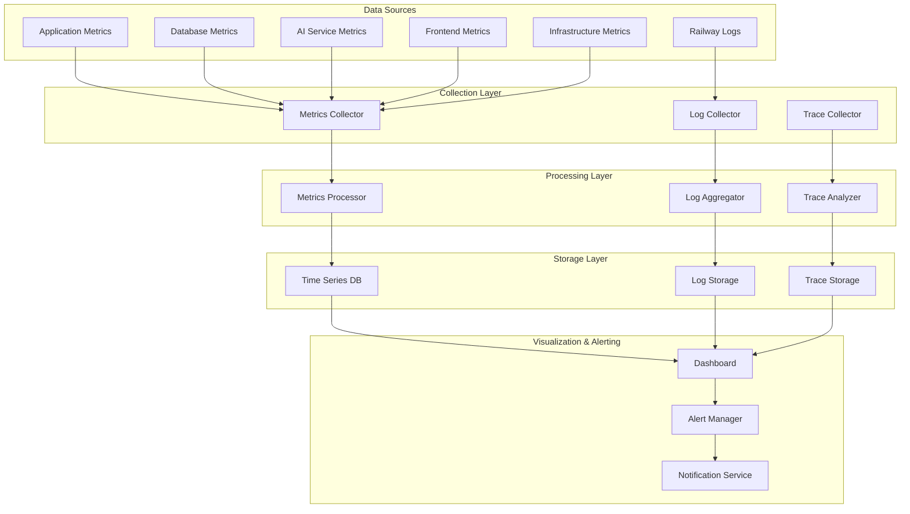

# VoteLens AI - Production Monitoring Architecture

## Executive Summary

This document outlines a comprehensive monitoring architecture for VoteLens AI on Railway, covering application performance, database health, AI service usage, frontend metrics, and infrastructure monitoring with real-time alerting and diagnostics.

---

## Table of Contents

1. [Monitoring Architecture Overview](#monitoring-architecture-overview)
2. [Railway Logs Integration](#railway-logs-integration)
3. [API Monitoring](#api-monitoring)
4. [Frontend Monitoring](#frontend-monitoring)
5. [AI Usage Tracking](#ai-usage-tracking)
6. [PostgreSQL Monitoring](#postgresql-monitoring)
7. [Uptime Monitoring](#uptime-monitoring)
8. [Memory Usage Monitoring](#memory-usage-monitoring)
9. [Alerting Strategy](#alerting-strategy)
10. [Production Diagnostics](#production-diagnostics)

---

## Monitoring Architecture Overview

### 1. Monitoring Stack Architecture



### 2. Monitoring Components

| Component | Purpose | Technology | Data Source |
|-----------|---------|-------------|-------------|
| **Log Collector** | Centralized log collection | Fluent Bit | Railway logs, app logs |
| **Metrics Collector** | Performance metrics collection | Prometheus | App, DB, AI services |
| **Trace Collector** | Distributed tracing | OpenTelemetry | HTTP requests, DB queries |
| **Dashboard** | Visualization & monitoring | Grafana | All metrics & traces |
| **Alert Manager** | Alert processing & routing | AlertManager | All monitoring data |
| **Notification Service** | Alert delivery | Multi-channel | Alert Manager |

---

## Railway Logs Integration

### 1. Railway Log Collector

```typescript
// src/monitoring/railway-log-collector.ts
export class RailwayLogCollector {
  private logBuffer: LogEntry[] = [];
  private batchSize = 100;
  private flushInterval = 5000; // 5 seconds
  private railwayAPI: RailwayAPI;
  private logProcessor: LogProcessor;
  
  constructor() {
    this.railwayAPI = new RailwayAPI({
      token: process.env.RAILWAY_TOKEN
    });
    this.logProcessor = new LogProcessor();
    this.startLogCollection();
  }
  
  private startLogCollection(): void {
    // Start periodic log collection
    setInterval(() => {
      this.collectRailwayLogs();
    }, this.flushInterval);
    
    // Start log processing
    setInterval(() => {
      this.processLogBuffer();
    }, this.flushInterval);
  }
  
  private async collectRailwayLogs(): Promise<void> {
    try {
      const services = await this.railwayAPI.getServices();
      
      for (const service of services) {
        const logs = await this.railwayAPI.getServiceLogs(service.id, {
          since: new Date(Date.now() - this.flushInterval),
          limit: this.batchSize
        });
        
        for (const log of logs) {
          this.addToBuffer({
            timestamp: new Date(log.timestamp),
            level: this.mapLogLevel(log.level),
            message: log.message,
            service: service.name,
            serviceId: service.id,
            environment: service.environment,
            metadata: {
              requestId: log.requestId,
              userId: log.userId,
              duration: log.duration,
              statusCode: log.statusCode
            }
          });
        }
      }
      
    } catch (error) {
      console.error('Failed to collect Railway logs:', error);
    }
  }
  
  private addToBuffer(logEntry: LogEntry): void {
    this.logBuffer.push(logEntry);
    
    if (this.logBuffer.length >= this.batchSize) {
      this.processLogBuffer();
    }
  }
  
  private async processLogBuffer(): Promise<void> {
    if (this.logBuffer.length === 0) return;
    
    const logs = [...this.logBuffer];
    this.logBuffer = [];
    
    try {
      // Process and enrich logs
      const enrichedLogs = await this.logProcessor.processBatch(logs);
      
      // Send to log storage
      await this.sendToLogStorage(enrichedLogs);
      
      // Update metrics
      this.updateLogMetrics(enrichedLogs);
      
    } catch (error) {
      console.error('Failed to process log buffer:', error);
      // Re-add logs to buffer for retry
      this.logBuffer.unshift(...logs);
    }
  }
  
  private async sendToLogStorage(logs: LogEntry[]): Promise<void> {
    // Send to Elasticsearch or other log storage
    const logStorage = new LogStorageService();
    await logStorage.bulkInsert(logs);
  }
  
  private updateLogMetrics(logs: LogEntry[]): void {
    const metrics = new MetricsService();
    
    // Count logs by level
    const levelCounts = logs.reduce((acc, log) => {
      acc[log.level] = (acc[log.level] || 0) + 1;
      return acc;
    }, {} as Record<string, number>);
    
    Object.entries(levelCounts).forEach(([level, count]) => {
      metrics.recordCounter('logs_total', count, { level });
    });
    
    // Count logs by service
    const serviceCounts = logs.reduce((acc, log) => {
      acc[log.service] = (acc[log.service] || 0) + 1;
      return acc;
    }, {} as Record<string, number>);
    
    Object.entries(serviceCounts).forEach(([service, count]) => {
      metrics.recordCounter('logs_by_service_total', count, { service });
    });
  }
  
  private mapLogLevel(railwayLevel: string): LogLevel {
    const mapping: Record<string, LogLevel> = {
      'DEBUG': 'debug',
      'INFO': 'info',
      'WARN': 'warn',
      'ERROR': 'error',
      'FATAL': 'fatal'
    };
    
    return mapping[railwayLevel.toUpperCase()] || 'info';
  }
}
```

### 2. Enhanced Logging Middleware

```typescript
// src/middleware/enhanced-logging.middleware.ts
export class EnhancedLoggingMiddleware {
  private logCollector: RailwayLogCollector;
  private traceService: TraceService;
  
  constructor() {
    this.logCollector = new RailwayLogCollector();
    this.traceService = new TraceService();
  }
  
  // Enhanced request logging
  requestLogger() {
    return (req: Request, res: Response, next: NextFunction) => {
      const requestId = req.headers['x-request-id'] || crypto.randomUUID();
      const startTime = process.hrtime.bigint();
      
      // Add request ID to response headers
      res.set('X-Request-ID', requestId);
      req.requestId = requestId;
      
      // Log request start
      this.logRequest(req, requestId);
      
      // Intercept response
      const originalSend = res.send;
      res.send = function(data: any) {
        const endTime = process.hrtime.bigint();
        const duration = Number(endTime - startTime) / 1000000; // Convert to ms
        
        // Log response
        this.logResponse(req, res, data, duration, requestId);
        
        return originalSend.call(this, data);
      }.bind(this);
      
      next();
    };
  }
  
  private logRequest(req: Request, requestId: string): void {
    const logEntry: LogEntry = {
      timestamp: new Date(),
      level: 'info',
      message: `HTTP ${req.method} ${req.path}`,
      service: 'backend',
      metadata: {
        requestId,
        method: req.method,
        path: req.path,
        query: req.query,
        userAgent: req.get('User-Agent'),
        ip: req.ip,
        userId: (req as any).user?.id
      }
    };
    
    this.logCollector.addLog(logEntry);
  }
  
  private logResponse(
    req: Request,
    res: Response,
    data: any,
    duration: number,
    requestId: string
  ): void {
    const level = res.statusCode >= 400 ? 'error' : 'info';
    
    const logEntry: LogEntry = {
      timestamp: new Date(),
      level,
      message: `HTTP ${req.method} ${req.path} - ${res.statusCode}`,
      service: 'backend',
      metadata: {
        requestId,
        method: req.method,
        path: req.path,
        statusCode: res.statusCode,
        duration,
        responseSize: this.getResponseSize(data),
        userId: (req as any).user?.id
      }
    };
    
    this.logCollector.addLog(logEntry);
    
    // Record metrics
    this.recordRequestMetrics(req, res, duration);
  }
  
  private recordRequestMetrics(
    req: Request,
    res: Response,
    duration: number
  ): void {
    const metrics = new MetricsService();
    
    metrics.recordHistogram('http_request_duration_ms', duration, {
      method: req.method,
      route: req.route?.path || req.path,
      status: res.statusCode.toString()
    });
    
    metrics.recordCounter('http_requests_total', 1, {
      method: req.method,
      route: req.route?.path || req.path,
      status: res.statusCode.toString()
    });
  }
  
  private getResponseSize(data: any): number {
    if (!data) return 0;
    return Buffer.byteLength(typeof data === 'string' ? data : JSON.stringify(data));
  }
}
```

---

## API Monitoring

### 1. API Metrics Collection

```typescript
// src/monitoring/api-monitor.service.ts
export class APIMonitorService {
  private metrics: MetricsService;
  private alertManager: AlertManager;
  private performanceTracker: PerformanceTracker;
  
  constructor() {
    this.metrics = new MetricsService();
    this.alertManager = new AlertManager();
    this.performanceTracker = new PerformanceTracker();
    this.startMonitoring();
  }
  
  private startMonitoring(): void {
    // Collect API metrics every 30 seconds
    setInterval(async () => {
      await this.collectAPIMetrics();
    }, 30000);
    
    // Analyze performance trends every 5 minutes
    setInterval(async () => {
      await this.analyzePerformanceTrends();
    }, 300000);
  }
  
  private async collectAPIMetrics(): Promise<void> {
    const metrics = await this.getAPIMetrics();
    
    // Record API performance metrics
    this.metrics.recordGauge('api_requests_per_second', metrics.requestsPerSecond);
    this.metrics.recordGauge('api_average_response_time', metrics.avgResponseTime);
    this.metrics.recordGauge('api_error_rate', metrics.errorRate);
    this.metrics.recordGauge('api_active_connections', metrics.activeConnections);
    
    // Record endpoint-specific metrics
    metrics.endpoints.forEach(endpoint => {
      this.metrics.recordHistogram(
        'api_endpoint_response_time',
        endpoint.avgResponseTime,
        {
          endpoint: endpoint.path,
          method: endpoint.method
        }
      );
      
      this.metrics.recordCounter(
        'api_endpoint_requests',
        endpoint.requestCount,
        {
          endpoint: endpoint.path,
          method: endpoint.method,
          status: 'success'
        }
      );
    });
    
    // Check for alerts
    await this.checkAPIAlerts(metrics);
  }
  
  private async getAPIMetrics(): Promise<APIMetrics> {
    // Get metrics from database or cache
    const timeRange = '5 minutes';
    
    const [
      totalRequests,
      errorRequests,
      responseTimes,
      activeConnections
    ] = await Promise.all([
      this.getTotalRequests(timeRange),
      this.getErrorRequests(timeRange),
      this.getResponseTimes(timeRange),
      this.getActiveConnections()
    ]);
    
    const requestsPerSecond = totalRequests / 300; // 5 minutes = 300 seconds
    const errorRate = totalRequests > 0 ? errorRequests / totalRequests : 0;
    const avgResponseTime = responseTimes.length > 0 
      ? responseTimes.reduce((a, b) => a + b, 0) / responseTimes.length 
      : 0;
    
    const endpoints = await this.getEndpointMetrics(timeRange);
    
    return {
      requestsPerSecond,
      avgResponseTime,
      errorRate,
      activeConnections,
      endpoints,
      timestamp: new Date()
    };
  }
  
  private async checkAPIAlerts(metrics: APIMetrics): Promise<void> {
    // High error rate alert
    if (metrics.errorRate > 0.05) { // 5%
      await this.alertManager.sendAlert({
        type: 'high_api_error_rate',
        severity: 'critical',
        message: `API error rate is ${(metrics.errorRate * 100).toFixed(2)}%`,
        value: metrics.errorRate,
        threshold: 0.05,
        timestamp: new Date()
      });
    }
    
    // High response time alert
    if (metrics.avgResponseTime > 2000) { // 2 seconds
      await this.alertManager.sendAlert({
        type: 'high_api_response_time',
        severity: 'warning',
        message: `API average response time is ${metrics.avgResponseTime.toFixed(2)}ms`,
        value: metrics.avgResponseTime,
        threshold: 2000,
        timestamp: new Date()
      });
    }
    
    // Low throughput alert
    if (metrics.requestsPerSecond < 1) { // Less than 1 RPS
      await this.alertManager.sendAlert({
        type: 'low_api_throughput',
        severity: 'warning',
        message: `API throughput is ${metrics.requestsPerSecond.toFixed(2)} RPS`,
        value: metrics.requestsPerSecond,
        threshold: 1,
        timestamp: new Date()
      });
    }
  }
  
  // Track individual API calls
  trackAPICall(
    endpoint: string,
    method: string,
    statusCode: number,
    duration: number,
    userId?: string
  ): void {
    this.metrics.recordHistogram('api_call_duration', duration, {
      endpoint,
      method,
      status: statusCode.toString()
    });
    
    this.metrics.recordCounter('api_calls_total', 1, {
      endpoint,
      method,
      status: statusCode.toString(),
      user_id: userId || 'anonymous'
    });
    
    // Track slow calls
    if (duration > 5000) { // 5 seconds
      this.alertManager.sendAlert({
        type: 'slow_api_call',
        severity: 'info',
        message: `Slow API call: ${method} ${endpoint} took ${duration}ms`,
        value: duration,
        threshold: 5000,
        metadata: { endpoint, method, userId }
      });
    }
  }
}
```

### 2. API Health Monitoring

```typescript
// src/monitoring/api-health.service.ts
export class APIHealthService {
  private healthChecks: Map<string, HealthCheck> = new Map();
  private metrics: MetricsService;
  
  constructor() {
    this.metrics = new MetricsService();
    this.setupHealthChecks();
    this.startHealthMonitoring();
  }
  
  private setupHealthChecks(): void {
    // API endpoints health checks
    this.healthChecks.set('api_health', {
      name: 'API Health',
      endpoint: '/health',
      method: 'GET',
      interval: 30000, // 30 seconds
      timeout: 5000, // 5 seconds
      expectedStatus: 200
    });
    
    // Database health check
    this.healthChecks.set('database_health', {
      name: 'Database Health',
      endpoint: '/health/db',
      method: 'GET',
      interval: 60000, // 1 minute
      timeout: 10000, // 10 seconds
      expectedStatus: 200
    });
    
    // AI service health check
    this.healthChecks.set('ai_service_health', {
      name: 'AI Service Health',
      endpoint: '/health/ai',
      method: 'GET',
      interval: 60000, // 1 minute
      timeout: 15000, // 15 seconds
      expectedStatus: 200
    });
    
    // Cache health check
    this.healthChecks.set('cache_health', {
      name: 'Cache Health',
      endpoint: '/health/cache',
      method: 'GET',
      interval: 30000, // 30 seconds
      timeout: 5000, // 5 seconds
      expectedStatus: 200
    });
  }
  
  private startHealthMonitoring(): void {
    this.healthChecks.forEach((healthCheck, key) => {
      setInterval(async () => {
        await this.performHealthCheck(key, healthCheck);
      }, healthCheck.interval);
    });
  }
  
  private async performHealthCheck(
    key: string,
    healthCheck: HealthCheck
  ): Promise<void> {
    const startTime = Date.now();
    
    try {
      const response = await fetch(
        `${process.env.API_BASE_URL}${healthCheck.endpoint}`,
        {
          method: healthCheck.method,
          signal: AbortSignal.timeout(healthCheck.timeout)
        }
      );
      
      const duration = Date.now() - startTime;
      const isHealthy = response.status === healthCheck.expectedStatus;
      
      // Record health check metrics
      this.metrics.recordGauge(`health_check_${key}_status`, isHealthy ? 1 : 0);
      this.metrics.recordHistogram(`health_check_${key}_duration`, duration);
      
      // Update health status
      await this.updateHealthStatus(key, {
        status: isHealthy ? 'healthy' : 'unhealthy',
        lastCheck: new Date(),
        responseTime: duration,
        statusCode: response.status,
        error: null
      });
      
      // Send alert if unhealthy
      if (!isHealthy) {
        await this.sendHealthAlert(key, healthCheck, {
          statusCode: response.status,
          responseTime: duration
        });
      }
      
    } catch (error) {
      const duration = Date.now() - startTime;
      
      // Record failed health check
      this.metrics.recordGauge(`health_check_${key}_status`, 0);
      this.metrics.recordHistogram(`health_check_${key}_duration`, duration);
      
      // Update health status
      await this.updateHealthStatus(key, {
        status: 'unhealthy',
        lastCheck: new Date(),
        responseTime: duration,
        statusCode: 0,
        error: error.message
      });
      
      // Send alert
      await this.sendHealthAlert(key, healthCheck, {
        error: error.message,
        responseTime: duration
      });
    }
  }
  
  private async updateHealthStatus(
    key: string,
    status: HealthStatus
  ): Promise<void> {
    const healthStorage = new HealthStorageService();
    await healthStorage.updateHealthStatus(key, status);
  }
  
  private async sendHealthAlert(
    key: string,
    healthCheck: HealthCheck,
    details: any
  ): Promise<void> {
    const alertManager = new AlertManager();
    
    await alertManager.sendAlert({
      type: 'health_check_failure',
      severity: 'critical',
      message: `Health check failed: ${healthCheck.name}`,
      value: 0,
      threshold: 1,
      metadata: {
        healthCheck: key,
        endpoint: healthCheck.endpoint,
        ...details
      }
    });
  }
  
  // Get overall health status
  async getOverallHealth(): Promise<OverallHealth> {
    const healthStorage = new HealthStorageService();
    const statuses = await healthStorage.getAllHealthStatuses();
    
    const healthyChecks = Object.values(statuses).filter(s => s.status === 'healthy').length;
    const totalChecks = Object.keys(statuses).length;
    const overallStatus = healthyChecks === totalChecks ? 'healthy' : 
                        healthyChecks > 0 ? 'degraded' : 'unhealthy';
    
    return {
      status: overallStatus,
      checks: statuses,
      timestamp: new Date(),
      healthyPercentage: (healthyChecks / totalChecks) * 100
    };
  }
}
```

---

## Frontend Monitoring

### 1. Frontend Performance Monitoring

```typescript
// src/monitoring/frontend-monitor.service.ts
export class FrontendMonitorService {
  private metrics: MetricsService;
  private errorTracker: ErrorTracker;
  
  constructor() {
    this.metrics = new MetricsService();
    this.errorTracker = new ErrorTracker();
    this.setupFrontendMonitoring();
  }
  
  private setupFrontendMonitoring(): void {
    // Core Web Vitals monitoring
    this.trackCoreWebVitals();
    
    // User interaction tracking
    this.trackUserInteractions();
    
    // Error monitoring
    this.trackErrors();
    
    // Resource loading monitoring
    this.trackResourceLoading();
  }
  
  private trackCoreWebVitals(): void {
    // Largest Contentful Paint (LCP)
    this.observePerformanceEntry('largest-contentful-paint', (entry) => {
      this.metrics.recordHistogram('frontend_lcp', entry.startTime, {
        page: window.location.pathname
      });
    });
    
    // First Input Delay (FID)
    this.observePerformanceEntry('first-input', (entry) => {
      if (entry.processingStart) {
        const fid = entry.processingStart - entry.startTime;
        this.metrics.recordHistogram('frontend_fid', fid, {
          page: window.location.pathname
        });
      }
    });
    
    // Cumulative Layout Shift (CLS)
    let clsValue = 0;
    this.observePerformanceEntry('layout-shift', (entry) => {
      if (!entry.hadRecentInput) {
        clsValue += entry.value;
        this.metrics.recordHistogram('frontend_cls', clsValue, {
          page: window.location.pathname
        });
      }
    });
    
    // First Contentful Paint (FCP)
    this.observePerformanceEntry('paint', (entry) => {
      if (entry.name === 'first-contentful-paint') {
        this.metrics.recordHistogram('frontend_fcp', entry.startTime, {
          page: window.location.pathname
        });
      }
    });
  }
  
  private trackUserInteractions(): void {
    // Track click events
    document.addEventListener('click', (event) => {
      const target = event.target as Element;
      const element = this.getElementInfo(target);
      
      this.metrics.recordCounter('frontend_clicks_total', 1, {
        element_type: element.type,
        element_id: element.id,
        page: window.location.pathname
      });
    });
    
    // Track form submissions
    document.addEventListener('submit', (event) => {
      const form = event.target as HTMLFormElement;
      const formName = form.name || form.id || 'unnamed';
      
      this.metrics.recordCounter('frontend_form_submissions_total', 1, {
        form_name: formName,
        page: window.location.pathname
      });
    });
    
    // Track page views
    this.trackPageViews();
  }
  
  private trackPageViews(): void {
    let lastPage = window.location.pathname;
    
    // Initial page view
    this.metrics.recordCounter('frontend_page_views_total', 1, {
      page: lastPage,
      referrer: document.referrer || 'direct'
    });
    
    // Track SPA navigation
    const originalPushState = history.pushState;
    const originalReplaceState = history.replaceState;
    
    history.pushState = function(...args) {
      originalPushState.apply(this, args);
      setTimeout(() => {
        const newPage = window.location.pathname;
        if (newPage !== lastPage) {
          this.metrics.recordCounter('frontend_page_views_total', 1, {
            page: newPage,
            referrer: lastPage
          });
          lastPage = newPage;
        }
      }, 0);
    }.bind(this);
    
    history.replaceState = function(...args) {
      originalReplaceState.apply(this, args);
      setTimeout(() => {
        const newPage = window.location.pathname;
        if (newPage !== lastPage) {
          this.metrics.recordCounter('frontend_page_views_total', 1, {
            page: newPage,
            referrer: lastPage
          });
          lastPage = newPage;
        }
      }, 0);
    }.bind(this);
  }
  
  private trackErrors(): void {
    // JavaScript errors
    window.addEventListener('error', (event) => {
      this.metrics.recordCounter('frontend_js_errors_total', 1, {
        error_message: event.message,
        error_filename: event.filename,
        error_lineno: event.lineno.toString(),
        page: window.location.pathname
      });
      
      this.errorTracker.trackError({
        type: 'javascript',
        message: event.message,
        filename: event.filename,
        lineno: event.lineno,
        colno: event.colno,
        stack: event.error?.stack,
        timestamp: new Date(),
        userAgent: navigator.userAgent,
        page: window.location.pathname
      });
    });
    
    // Unhandled promise rejections
    window.addEventListener('unhandledrejection', (event) => {
      this.metrics.recordCounter('frontend_promise_rejections_total', 1, {
        error_message: event.reason?.message || 'Unknown promise rejection',
        page: window.location.pathname
      });
      
      this.errorTracker.trackError({
        type: 'promise_rejection',
        message: event.reason?.message || 'Unknown promise rejection',
        reason: event.reason,
        timestamp: new Date(),
        userAgent: navigator.userAgent,
        page: window.location.pathname
      });
    });
  }
  
  private trackResourceLoading(): void {
    this.observePerformanceEntry('resource', (entry) => {
      const resource = entry as PerformanceResourceTiming;
      
      this.metrics.recordHistogram('frontend_resource_load_time', resource.duration, {
        resource_type: this.getResourceType(resource.name),
        resource_size: resource.transferSize?.toString() || 'unknown',
        page: window.location.pathname
      });
      
      // Track slow resources
      if (resource.duration > 3000) { // 3 seconds
        this.metrics.recordCounter('frontend_slow_resources_total', 1, {
          resource_type: this.getResourceType(resource.name),
          resource_url: resource.name,
          page: window.location.pathname
        });
      }
    });
  }
  
  private observePerformanceEntry(
    type: string,
    callback: (entry: PerformanceEntry) => void
  ): void {
    const observer = new PerformanceObserver((list) => {
      list.getEntries().forEach(callback);
    });
    
    observer.observe({ type, buffered: true });
  }
  
  private getElementInfo(element: Element): { type: string; id: string } {
    return {
      type: element.tagName.toLowerCase(),
      id: element.id || 'no-id'
    };
  }
  
  private getResourceType(url: string): string {
    if (url.endsWith('.js')) return 'script';
    if (url.endsWith('.css')) return 'stylesheet';
    if (url.match(/\.(png|jpg|jpeg|gif|webp|svg)$/i)) return 'image';
    if (url.match(/\.(woff|woff2|ttf|eot)$/i)) return 'font';
    return 'other';
  }
}
```

### 2. Frontend Error Tracking

```typescript
// src/monitoring/frontend-error-tracker.ts
export class FrontendErrorTracker {
  private errorBuffer: FrontendError[] = [];
  private maxBufferSize = 100;
  private flushInterval = 10000; // 10 seconds
  
  constructor() {
    this.startErrorTracking();
  }
  
  private startErrorTracking(): void {
    // Flush errors periodically
    setInterval(() => {
      this.flushErrors();
    }, this.flushInterval);
  }
  
  trackError(error: FrontendError): void {
    // Add to buffer
    this.errorBuffer.push(error);
    
    // Flush if buffer is full
    if (this.errorBuffer.length >= this.maxBufferSize) {
      this.flushErrors();
    }
  }
  
  private async flushErrors(): Promise<void> {
    if (this.errorBuffer.length === 0) return;
    
    const errors = [...this.errorBuffer];
    this.errorBuffer = [];
    
    try {
      // Send errors to backend
      await this.sendErrorsToBackend(errors);
      
      // Update error metrics
      this.updateErrorMetrics(errors);
      
    } catch (sendError) {
      console.error('Failed to send errors to backend:', sendError);
      // Re-add errors to buffer for retry
      this.errorBuffer.unshift(...errors);
    }
  }
  
  private async sendErrorsToBackend(errors: FrontendError[]): Promise<void> {
    await fetch('/api/v1/monitoring/frontend-errors', {
      method: 'POST',
      headers: {
        'Content-Type': 'application/json'
      },
      body: JSON.stringify({
        errors,
        timestamp: new Date(),
        userAgent: navigator.userAgent,
        url: window.location.href
      })
    });
  }
  
  private updateErrorMetrics(errors: FrontendError[]): void {
    const metrics = new MetricsService();
    
    // Count errors by type
    const typeCounts = errors.reduce((acc, error) => {
      acc[error.type] = (acc[error.type] || 0) + 1;
      return acc;
    }, {} as Record<string, number>);
    
    Object.entries(typeCounts).forEach(([type, count]) => {
      metrics.recordCounter('frontend_errors_total', count, {
        error_type: type
      });
    });
    
    // Count errors by page
    const pageCounts = errors.reduce((acc, error) => {
      acc[error.page] = (acc[error.page] || 0) + 1;
      return acc;
    }, {} as Record<string, number>);
    
    Object.entries(pageCounts).forEach(([page, count]) => {
      metrics.recordCounter('frontend_page_errors_total', count, {
        page
      });
    });
  }
}
```

---

## AI Usage Tracking

### 1. AI Service Monitoring

```typescript
// src/monitoring/ai-usage-tracker.ts
export class AIUsageTracker {
  private metrics: MetricsService;
  private costTracker: CostTracker;
  private usageBuffer: AIUsageEntry[] = [];
  
  constructor() {
    this.metrics = new MetricsService();
    this.costTracker = new CostTracker();
    this.startUsageTracking();
  }
  
  private startUsageTracking(): void {
    // Flush usage data every minute
    setInterval(() => {
      this.flushUsageData();
    }, 60000);
    
    // Generate hourly reports
    setInterval(() => {
      this.generateHourlyReport();
    }, 3600000);
  }
  
  trackAIRequest(
    request: AIRequest,
    response: AIResponse,
    duration: number,
    userId?: string
  ): void {
    const usageEntry: AIUsageEntry = {
      timestamp: new Date(),
      userId: userId || 'anonymous',
      model: request.model || 'gemini-pro',
      tokensUsed: response.tokensUsed,
      cost: this.calculateCost(response.tokensUsed, request.model),
      duration,
      cacheHit: response.isCached,
      queryType: this.classifyQuery(request.query),
      electionId: request.electionId,
      constituencyId: request.constituencyId,
      success: true
    };
    
    this.usageBuffer.push(usageEntry);
    
    // Update real-time metrics
    this.updateRealTimeMetrics(usageEntry);
  }
  
  trackAIError(
    request: AIRequest,
    error: Error,
    duration: number,
    userId?: string
  ): void {
    const usageEntry: AIUsageEntry = {
      timestamp: new Date(),
      userId: userId || 'anonymous',
      model: request.model || 'gemini-pro',
      tokensUsed: 0,
      cost: 0,
      duration,
      cacheHit: false,
      queryType: this.classifyQuery(request.query),
      electionId: request.electionId,
      constituencyId: request.constituencyId,
      success: false,
      error: error.message
    };
    
    this.usageBuffer.push(usageEntry);
    
    // Update error metrics
    this.updateErrorMetrics(usageEntry);
  }
  
  private updateRealTimeMetrics(entry: AIUsageEntry): void {
    // Request metrics
    this.metrics.recordCounter('ai_requests_total', 1, {
      model: entry.model,
      query_type: entry.queryType,
      success: entry.success.toString(),
      cache_hit: entry.cacheHit.toString()
    });
    
    // Token usage metrics
    this.metrics.recordHistogram('ai_tokens_used', entry.tokensUsed, {
      model: entry.model,
      query_type: entry.queryType
    });
    
    // Cost metrics
    this.metrics.recordHistogram('ai_request_cost', entry.cost, {
      model: entry.model,
      query_type: entry.queryType
    });
    
    // Response time metrics
    this.metrics.recordHistogram('ai_response_time', entry.duration, {
      model: entry.model,
      query_type: entry.queryType,
      cache_hit: entry.cacheHit.toString()
    });
    
    // User metrics
    this.metrics.recordCounter('ai_user_requests_total', 1, {
      user_id: entry.userId,
      model: entry.model
    });
  }
  
  private updateErrorMetrics(entry: AIUsageEntry): void {
    this.metrics.recordCounter('ai_errors_total', 1, {
      model: entry.model,
      query_type: entry.queryType,
      error_type: this.classifyError(entry.error!)
    });
  }
  
  private classifyQuery(query: string): string {
    const lowerQuery = query.toLowerCase();
    
    if (lowerQuery.includes('trend') || lowerQuery.includes('pattern')) {
      return 'trend_analysis';
    } else if (lowerQuery.includes('predict') || lowerQuery.includes('forecast')) {
      return 'prediction';
    } else if (lowerQuery.includes('compare') || lowerQuery.includes('difference')) {
      return 'comparison';
    } else if (lowerQuery.includes('summar') || lowerQuery.includes('overview')) {
      return 'summary';
    } else if (lowerQuery.includes('what') || lowerQuery.includes('who')) {
      return 'question';
    } else {
      return 'general';
    }
  }
  
  private classifyError(error: string): string {
    if (error.includes('rate limit')) {
      return 'rate_limit';
    } else if (error.includes('timeout')) {
      return 'timeout';
    } else if (error.includes('quota')) {
      return 'quota_exceeded';
    } else if (error.includes('authentication')) {
      return 'authentication';
    } else if (error.includes('network')) {
      return 'network';
    } else {
      return 'unknown';
    }
  }
  
  private calculateCost(tokens: number, model: string): number {
    const costPerToken = this.getCostPerToken(model);
    return tokens * costPerToken;
  }
  
  private getCostPerToken(model: string): number {
    const costs: Record<string, number> = {
      'gemini-pro': 0.000001, // $0.000001 per token
      'gemini-pro-vision': 0.0000025,
      'gemini-1.5-pro': 0.0000008
    };
    
    return costs[model] || 0.000001;
  }
  
  private async flushUsageData(): Promise<void> {
    if (this.usageBuffer.length === 0) return;
    
    const usageData = [...this.usageBuffer];
    this.usageBuffer = [];
    
    try {
      // Store usage data
      const usageStorage = new AIUsageStorageService();
      await usageStorage.bulkInsert(usageData);
      
      // Update cost tracker
      const totalCost = usageData.reduce((sum, entry) => sum + entry.cost, 0);
      this.costTracker.addCost(totalCost);
      
    } catch (error) {
      console.error('Failed to flush AI usage data:', error);
      // Re-add to buffer for retry
      this.usageBuffer.unshift(...usageData);
    }
  }
  
  private async generateHourlyReport(): Promise<void> {
    const usageStorage = new AIUsageStorageService();
    const hourlyStats = await usageStorage.getHourlyStats();
    
    // Send report to monitoring service
    const monitoringService = new MonitoringService();
    await monitoringService.sendAIUsageReport(hourlyStats);
    
    // Check for cost alerts
    if (hourlyStats.totalCost > 10) { // $10 per hour threshold
      const alertManager = new AlertManager();
      await alertManager.sendAlert({
        type: 'high_ai_cost',
        severity: 'warning',
        message: `AI usage cost is $${hourlyStats.totalCost.toFixed(2)} per hour`,
        value: hourlyStats.totalCost,
        threshold: 10,
        timestamp: new Date()
      });
    }
  }
  
  // Get AI usage analytics
  async getUsageAnalytics(
    timeRange: string = '24 hours'
  ): Promise<AIUsageAnalytics> {
    const usageStorage = new AIUsageStorageService();
    const data = await usageStorage.getUsageData(timeRange);
    
    return {
      totalRequests: data.length,
      successfulRequests: data.filter(d => d.success).length,
      failedRequests: data.filter(d => !d.success).length,
      totalTokens: data.reduce((sum, d) => sum + d.tokensUsed, 0),
      totalCost: data.reduce((sum, d) => sum + d.cost, 0),
      averageResponseTime: data.reduce((sum, d) => sum + d.duration, 0) / data.length,
      cacheHitRate: data.filter(d => d.cacheHit).length / data.length,
      topModels: this.getTopModels(data),
      topQueryTypes: this.getTopQueryTypes(data),
      topUsers: this.getTopUsers(data),
      timeRange
    };
  }
  
  private getTopModels(data: AIUsageEntry[]): ModelUsage[] {
    const modelUsage = data.reduce((acc, entry) => {
      if (!acc[entry.model]) {
        acc[entry.model] = { model: entry.model, requests: 0, cost: 0 };
      }
      acc[entry.model].requests++;
      acc[entry.model].cost += entry.cost;
      return acc;
    }, {} as Record<string, { model: string; requests: number; cost: number }>);
    
    return Object.values(modelUsage)
      .sort((a, b) => b.requests - a.requests)
      .slice(0, 10);
  }
  
  private getTopQueryTypes(data: AIUsageEntry[]): QueryTypeUsage[] {
    const typeUsage = data.reduce((acc, entry) => {
      if (!acc[entry.queryType]) {
        acc[entry.queryType] = { queryType: entry.queryType, requests: 0, avgDuration: 0 };
      }
      acc[entry.queryType].requests++;
      acc[entry.queryType].avgDuration += entry.duration;
      return acc;
    }, {} as Record<string, { queryType: string; requests: number; avgDuration: number }>);
    
    // Calculate average duration
    Object.values(typeUsage).forEach(type => {
      type.avgDuration = type.avgDuration / type.requests;
    });
    
    return Object.values(typeUsage)
      .sort((a, b) => b.requests - a.requests)
      .slice(0, 10);
  }
  
  private getTopUsers(data: AIUsageEntry[]): UserUsage[] {
    const userUsage = data.reduce((acc, entry) => {
      if (!acc[entry.userId]) {
        acc[entry.userId] = { userId: entry.userId, requests: 0, cost: 0 };
      }
      acc[entry.userId].requests++;
      acc[entry.userId].cost += entry.cost;
      return acc;
    }, {} as Record<string, { userId: string; requests: number; cost: number }>);
    
    return Object.values(userUsage)
      .sort((a, b) => b.requests - a.requests)
      .slice(0, 10);
  }
}
```

---

## PostgreSQL Monitoring

### 1. Database Performance Monitoring

```typescript
// src/monitoring/postgresql-monitor.service.ts
export class PostgreSQLMonitorService {
  private metrics: MetricsService;
  private alertManager: AlertManager;
  private connectionPool: ConnectionPool;
  
  constructor() {
    this.metrics = new MetricsService();
    this.alertManager = new AlertManager();
    this.connectionPool = new ConnectionPool();
    this.startDatabaseMonitoring();
  }
  
  private startDatabaseMonitoring(): void {
    // Collect database metrics every 30 seconds
    setInterval(async () => {
      await this.collectDatabaseMetrics();
    }, 30000);
    
    // Analyze slow queries every minute
    setInterval(async () => {
      await this.analyzeSlowQueries();
    }, 60000);
    
    // Check replication lag every 2 minutes
    setInterval(async () => {
      await this.checkReplicationLag();
    }, 120000);
  }
  
  private async collectDatabaseMetrics(): Promise<void> {
    try {
      const [
        connectionStats,
        performanceStats,
        sizeStats,
        lockStats
      ] = await Promise.all([
        this.getConnectionStats(),
        this.getPerformanceStats(),
        this.getSizeStats(),
        this.getLockStats()
      ]);
      
      // Record connection metrics
      this.metrics.recordGauge('db_connections_total', connectionStats.total);
      this.metrics.recordGauge('db_connections_active', connectionStats.active);
      this.metrics.recordGauge('db_connections_idle', connectionStats.idle);
      this.metrics.recordGauge('db_connections_waiting', connectionStats.waiting);
      
      // Record performance metrics
      this.metrics.recordGauge('db_query_time_avg', performanceStats.avgQueryTime);
      this.metrics.recordGauge('db_query_time_p95', performanceStats.p95QueryTime);
      this.metrics.recordGauge('db_queries_per_second', performanceStats.queriesPerSecond);
      this.metrics.recordGauge('db_cache_hit_rate', performanceStats.cacheHitRate);
      
      // Record size metrics
      this.metrics.recordGauge('db_size_bytes', sizeStats.totalSize);
      this.metrics.recordGauge('db_table_size_bytes', sizeStats.tableSize);
      this.metrics.recordGauge('db_index_size_bytes', sizeStats.indexSize);
      
      // Record lock metrics
      this.metrics.recordGauge('db_locks_waiting', lockStats.waitingLocks);
      this.metrics.recordGauge('db_locks_active', lockStats.activeLocks);
      
      // Check for alerts
      await this.checkDatabaseAlerts(connectionStats, performanceStats, sizeStats);
      
    } catch (error) {
      console.error('Failed to collect database metrics:', error);
      this.metrics.recordCounter('db_monitoring_errors_total', 1);
    }
  }
  
  private async getConnectionStats(): Promise<ConnectionStats> {
    const result = await this.connectionPool.query(`
      SELECT 
        count(*) as total,
        count(*) FILTER (WHERE state = 'active') as active,
        count(*) FILTER (WHERE state = 'idle') as idle,
        count(*) FILTER (WHERE wait_event_type = 'Lock') as waiting
      FROM pg_stat_activity 
      WHERE datname = current_database()
    `);
    
    return result[0] as ConnectionStats;
  }
  
  private async getPerformanceStats(): Promise<PerformanceStats> {
    const result = await this.connectionPool.query(`
      SELECT 
        avg(mean_exec_time) as avg_query_time,
        percentile_cont(0.95) WITHIN GROUP (ORDER BY mean_exec_time) as p95_query_time,
        sum(calls) / 60 as queries_per_second,
        sum(calls) / (sum(calls) + sum(rows)) as cache_hit_rate
      FROM pg_stat_statements 
      WHERE calls > 10
    `);
    
    return result[0] as PerformanceStats;
  }
  
  private async getSizeStats(): Promise<SizeStats> {
    const result = await this.connectionPool.query(`
      SELECT 
        pg_database_size(current_database()) as total_size,
        pg_total_relation_size('elections') as table_size,
        pg_indexes_size('elections') as index_size
    `);
    
    return result[0] as SizeStats;
  }
  
  private async getLockStats(): Promise<LockStats> {
    const result = await this.connectionPool.query(`
      SELECT 
        count(*) FILTER (WHERE granted = false) as waiting_locks,
        count(*) FILTER (WHERE granted = true) as active_locks
      FROM pg_locks 
      WHERE pid != pg_backend_pid()
    `);
    
    return result[0] as LockStats;
  }
  
  private async analyzeSlowQueries(): Promise<void> {
    const result = await this.connectionPool.query(`
      SELECT 
        query,
        calls,
        mean_exec_time,
        total_exec_time,
        rows
      FROM pg_stat_statements 
      WHERE mean_exec_time > 1000 
      ORDER BY mean_exec_time DESC 
      LIMIT 10
    `);
    
    const slowQueries = result as SlowQuery[];
    
    // Record slow query metrics
    slowQueries.forEach(query => {
      this.metrics.recordHistogram('db_slow_query_time', query.mean_exec_time, {
        query_hash: this.hashQuery(query.query)
      });
    });
    
    // Send alert for very slow queries
    const verySlowQueries = slowQueries.filter(q => q.mean_exec_time > 5000);
    if (verySlowQueries.length > 0) {
      await this.alertManager.sendAlert({
        type: 'slow_database_queries',
        severity: 'warning',
        message: `${verySlowQueries.length} database queries are slower than 5 seconds`,
        value: verySlowQueries.length,
        threshold: 0,
        metadata: { queries: verySlowQueries }
      });
    }
  }
  
  private async checkReplicationLag(): Promise<void> {
    try {
      const result = await this.connectionPool.query(`
        SELECT 
          pg_wal_lsn_diff(pg_current_wal_lsn(), replay_lsn) as lag_bytes,
          EXTRACT(EPOCH FROM (now() - pg_last_xact_replay_timestamp())) as lag_seconds
        FROM pg_stat_replication
      `);
      
      const replicationLag = result[0] as ReplicationLag;
      
      // Record replication metrics
      this.metrics.recordGauge('db_replication_lag_bytes', replicationLag.lag_bytes);
      this.metrics.recordGauge('db_replication_lag_seconds', replicationLag.lag_seconds);
      
      // Send alert for high replication lag
      if (replicationLag.lag_seconds > 60) { // 1 minute
        await this.alertManager.sendAlert({
          type: 'high_replication_lag',
          severity: 'critical',
          message: `Database replication lag is ${replicationLag.lag_seconds.toFixed(2)} seconds`,
          value: replicationLag.lag_seconds,
          threshold: 60
        });
      }
      
    } catch (error) {
      // Replication might not be configured
      console.log('Replication monitoring not available:', error.message);
    }
  }
  
  private async checkDatabaseAlerts(
    connectionStats: ConnectionStats,
    performanceStats: PerformanceStats,
    sizeStats: SizeStats
  ): Promise<void> {
    // High connection count alert
    if (connectionStats.total > 180) { // 90% of max 200
      await this.alertManager.sendAlert({
        type: 'high_db_connections',
        severity: 'warning',
        message: `Database has ${connectionStats.total} connections`,
        value: connectionStats.total,
        threshold: 180
      });
    }
    
    // High query time alert
    if (performanceStats.avgQueryTime > 1000) { // 1 second
      await this.alertManager.sendAlert({
        type: 'high_db_query_time',
        severity: 'warning',
        message: `Average query time is ${performanceStats.avgQueryTime.toFixed(2)}ms`,
        value: performanceStats.avgQueryTime,
        threshold: 1000
      });
    }
    
    // Low cache hit rate alert
    if (performanceStats.cacheHitRate < 0.8) { // 80%
      await this.alertManager.sendAlert({
        type: 'low_db_cache_hit_rate',
        severity: 'warning',
        message: `Database cache hit rate is ${(performanceStats.cacheHitRate * 100).toFixed(2)}%`,
        value: performanceStats.cacheHitRate,
        threshold: 0.8
      });
    }
    
    // High disk usage alert
    const sizeGB = sizeStats.totalSize / 1024 / 1024 / 1024;
    if (sizeGB > 80) { // 80GB
      await this.alertManager.sendAlert({
        type: 'high_db_disk_usage',
        severity: 'critical',
        message: `Database size is ${sizeGB.toFixed(2)}GB`,
        value: sizeGB,
        threshold: 80
      });
    }
  }
  
  private hashQuery(query: string): string {
    return crypto.createHash('md5').update(query).digest('hex');
  }
}
```

---

## Uptime Monitoring

### 1. Service Uptime Monitoring

```typescript
// src/monitoring/uptime-monitor.service.ts
export class UptimeMonitorService {
  private services: Map<string, MonitoredService> = new Map();
  private metrics: MetricsService;
  private alertManager: AlertManager;
  
  constructor() {
    this.metrics = new MetricsService();
    this.alertManager = new AlertManager();
    this.setupMonitoredServices();
    this.startUptimeMonitoring();
  }
  
  private setupMonitoredServices(): void {
    // Backend API
    this.services.set('backend_api', {
      name: 'Backend API',
      url: process.env.API_BASE_URL!,
      method: 'GET',
      endpoint: '/health',
      timeout: 10000,
      interval: 30000, // 30 seconds
      expectedStatus: 200
    });
    
    // Frontend
    this.services.set('frontend', {
      name: 'Frontend',
      url: process.env.FRONTEND_URL!,
      method: 'GET',
      endpoint: '/',
      timeout: 10000,
      interval: 60000, // 1 minute
      expectedStatus: 200
    });
    
    // Database
    this.services.set('database', {
      name: 'Database',
      url: process.env.API_BASE_URL!,
      method: 'GET',
      endpoint: '/health/db',
      timeout: 15000,
      interval: 30000, // 30 seconds
      expectedStatus: 200
    });
    
    // AI Service
    this.services.set('ai_service', {
      name: 'AI Service',
      url: process.env.API_BASE_URL!,
      method: 'GET',
      endpoint: '/health/ai',
      timeout: 15000,
      interval: 60000, // 1 minute
      expectedStatus: 200
    });
    
    // Cache Service
    this.services.set('cache_service', {
      name: 'Cache Service',
      url: process.env.API_BASE_URL!,
      method: 'GET',
      endpoint: '/health/cache',
      timeout: 5000,
      interval: 30000, // 30 seconds
      expectedStatus: 200
    });
  }
  
  private startUptimeMonitoring(): void {
    this.services.forEach((service, key) => {
      setInterval(async () => {
        await this.checkServiceHealth(key, service);
      }, service.interval);
    });
    
    // Calculate uptime every 5 minutes
    setInterval(async () => {
      await this.calculateUptime();
    }, 300000);
  }
  
  private async checkServiceHealth(
    key: string,
    service: MonitoredService
  ): Promise<void> {
    const startTime = Date.now();
    
    try {
      const response = await fetch(
        `${service.url}${service.endpoint}`,
        {
          method: service.method,
          signal: AbortSignal.timeout(service.timeout)
        }
      );
      
      const duration = Date.now() - startTime;
      const isHealthy = response.status === service.expectedStatus;
      
      // Record health check result
      await this.recordHealthCheck(key, {
        status: isHealthy ? 'up' : 'down',
        responseTime: duration,
        statusCode: response.status,
        timestamp: new Date(),
        error: null
      });
      
      // Update metrics
      this.metrics.recordGauge(`service_${key}_status`, isHealthy ? 1 : 0);
      this.metrics.recordHistogram(`service_${key}_response_time`, duration);
      
      // Send alert if service is down
      if (!isHealthy) {
        await this.sendServiceDownAlert(key, service, {
          statusCode: response.status,
          responseTime: duration
        });
      }
      
    } catch (error) {
      const duration = Date.now() - startTime;
      
      // Record failed health check
      await this.recordHealthCheck(key, {
        status: 'down',
        responseTime: duration,
        statusCode: 0,
        timestamp: new Date(),
        error: error.message
      });
      
      // Update metrics
      this.metrics.recordGauge(`service_${key}_status`, 0);
      this.metrics.recordHistogram(`service_${key}_response_time`, duration);
      
      // Send alert
      await this.sendServiceDownAlert(key, service, {
        error: error.message,
        responseTime: duration
      });
    }
  }
  
  private async recordHealthCheck(
    key: string,
    result: HealthCheckResult
  ): Promise<void> {
    const uptimeStorage = new UptimeStorageService();
    await uptimeStorage.recordHealthCheck(key, result);
  }
  
  private async sendServiceDownAlert(
    key: string,
    service: MonitoredService,
    details: any
  ): Promise<void> {
    await this.alertManager.sendAlert({
      type: 'service_down',
      severity: 'critical',
      message: `Service ${service.name} is down`,
      value: 0,
      threshold: 1,
      metadata: {
        service_key: key,
        service_name: service.name,
        service_url: `${service.url}${service.endpoint}`,
        ...details
      }
    });
  }
  
  private async calculateUptime(): Promise<void> {
    const uptimeStorage = new UptimeStorageService();
    const timeRange = '24 hours';
    
    for (const [key, service] of this.services.entries()) {
      const uptimeData = await uptimeStorage.getUptimeData(key, timeRange);
      
      const totalChecks = uptimeData.length;
      const upChecks = uptimeData.filter(check => check.status === 'up').length;
      const uptimePercentage = totalChecks > 0 ? (upChecks / totalChecks) * 100 : 0;
      
      // Record uptime metric
      this.metrics.recordGauge(`service_${key}_uptime_percentage`, uptimePercentage);
      
      // Send alert for low uptime
      if (uptimePercentage < 99) { // Less than 99% uptime
        await this.alertManager.sendAlert({
          type: 'low_service_uptime',
          severity: 'warning',
          message: `Service ${service.name} uptime is ${uptimePercentage.toFixed(2)}%`,
          value: uptimePercentage,
          threshold: 99,
          metadata: {
            service_key: key,
            service_name: service.name,
            uptime_percentage: uptimePercentage
          }
        });
      }
    }
  }
  
  // Get overall system uptime
  async getSystemUptime(timeRange: string = '24 hours'): Promise<SystemUptime> {
    const uptimeStorage = new UptimeStorageService();
    const uptimeData = await uptimeStorage.getAllUptimeData(timeRange);
    
    const systemUptime: SystemUptime = {
      timestamp: new Date(),
      timeRange,
      services: {}
    };
    
    for (const [key, service] of this.services.entries()) {
      const serviceData = uptimeData[key] || [];
      const totalChecks = serviceData.length;
      const upChecks = serviceData.filter(check => check.status === 'up').length;
      const uptimePercentage = totalChecks > 0 ? (upChecks / totalChecks) * 100 : 0;
      
      systemUptime.services[key] = {
        name: service.name,
        uptimePercentage,
        totalChecks,
        upChecks,
        downChecks: totalChecks - upChecks,
        averageResponseTime: this.calculateAverageResponseTime(serviceData)
      };
    }
    
    // Calculate overall system uptime
    const allServices = Object.values(systemUptime.services);
    const totalUptime = allServices.reduce((sum, service) => sum + service.uptimePercentage, 0);
    systemUptime.overallUptimePercentage = totalUptime / allServices.length;
    
    return systemUptime;
  }
  
  private calculateAverageResponseTime(healthChecks: HealthCheckResult[]): number {
    const validChecks = healthChecks.filter(check => check.responseTime > 0);
    if (validChecks.length === 0) return 0;
    
    const totalTime = validChecks.reduce((sum, check) => sum + check.responseTime, 0);
    return totalTime / validChecks.length;
  }
}
```

---

## Memory Usage Monitoring

### 1. Memory Monitoring Service

```typescript
// src/monitoring/memory-monitor.service.ts
export class MemoryMonitorService {
  private metrics: MetricsService;
  private alertManager: AlertManager;
  private memoryHistory: MemorySnapshot[] = [];
  private maxHistorySize = 1440; // 24 hours of minute data
  
  constructor() {
    this.metrics = new MetricsService();
    this.alertManager = new AlertManager();
    this.startMemoryMonitoring();
  }
  
  private startMemoryMonitoring(): void {
    // Collect memory metrics every 30 seconds
    setInterval(async () => {
      await this.collectMemoryMetrics();
    }, 30000);
    
    // Analyze memory trends every 5 minutes
    setInterval(async () => {
      await this.analyzeMemoryTrends();
    }, 300000);
    
    // Check for memory leaks every hour
    setInterval(async () => {
      await this.checkMemoryLeaks();
    }, 3600000);
  }
  
  private async collectMemoryMetrics(): Promise<void> {
    const memUsage = process.memoryUsage();
    const timestamp = new Date();
    
    // Record memory metrics
    this.metrics.recordGauge('memory_heap_used', memUsage.heapUsed);
    this.metrics.recordGauge('memory_heap_total', memUsage.heapTotal);
    this.metrics.recordGauge('memory_heap_external', memUsage.external);
    this.metrics.recordGauge('memory_rss', memUsage.rss);
    this.metrics.recordGauge('memory_array_buffers', memUsage.arrayBuffers);
    
    // Calculate memory usage percentages
    const heapUsagePercent = (memUsage.heapUsed / memUsage.heapTotal) * 100;
    this.metrics.recordGauge('memory_heap_usage_percent', heapUsagePercent);
    
    // Store in history
    const snapshot: MemorySnapshot = {
      timestamp,
      heapUsed: memUsage.heapUsed,
      heapTotal: memUsage.heapTotal,
      external: memUsage.external,
      rss: memUsage.rss,
      arrayBuffers: memUsage.arrayBuffers,
      heapUsagePercent
    };
    
    this.memoryHistory.push(snapshot);
    
    // Keep history size limited
    if (this.memoryHistory.length > this.maxHistorySize) {
      this.memoryHistory.shift();
    }
    
    // Check for immediate alerts
    await this.checkMemoryAlerts(snapshot);
  }
  
  private async checkMemoryAlerts(snapshot: MemorySnapshot): Promise<void> {
    // High heap usage alert
    if (snapshot.heapUsagePercent > 90) {
      await this.alertManager.sendAlert({
        type: 'high_memory_usage',
        severity: 'critical',
        message: `Memory usage is ${snapshot.heapUsagePercent.toFixed(2)}%`,
        value: snapshot.heapUsagePercent,
        threshold: 90,
        metadata: {
          heap_used: snapshot.heapUsed,
          heap_total: snapshot.heapTotal,
          heap_usage_mb: snapshot.heapUsed / 1024 / 1024
        }
      });
    }
    
    // Memory growth alert
    if (this.memoryHistory.length >= 10) {
      const recentSnapshots = this.memoryHistory.slice(-10);
      const oldestSnapshot = recentSnapshots[0];
      const growthRate = this.calculateGrowthRate(oldestSnapshot, snapshot);
      
      if (growthRate > 0.1) { // 10% growth over 5 minutes
        await this.alertManager.sendAlert({
          type: 'memory_growth',
          severity: 'warning',
          message: `Memory usage growing at ${(growthRate * 100).toFixed(2)}%`,
          value: growthRate,
          threshold: 0.1,
          metadata: {
            growth_rate: growthRate,
            old_usage_mb: oldestSnapshot.heapUsed / 1024 / 1024,
            current_usage_mb: snapshot.heapUsed / 1024 / 1024
          }
        });
      }
    }
  }
  
  private async analyzeMemoryTrends(): Promise<void> {
    if (this.memoryHistory.length < 60) return; // Need at least 30 minutes of data
    
    const recentSnapshots = this.memoryHistory.slice(-60); // Last 30 minutes
    const olderSnapshots = this.memoryHistory.slice(-120, -60); // Previous 30 minutes
    
    if (olderSnapshots.length === 0) return;
    
    const recentAvg = this.calculateAverageMemoryUsage(recentSnapshots);
    const olderAvg = this.calculateAverageMemoryUsage(olderSnapshots);
    
    const trend = (recentAvg - olderAvg) / olderAvg;
    
    // Record trend metric
    this.metrics.recordGauge('memory_trend_percent', trend * 100);
    
    // Alert on increasing trend
    if (trend > 0.05) { // 5% increase
      await this.alertManager.sendAlert({
        type: 'memory_trend_up',
        severity: 'info',
        message: `Memory usage trending up by ${(trend * 100).toFixed(2)}%`,
        value: trend,
        threshold: 0.05
      });
    }
  }
  
  private async checkMemoryLeaks(): Promise<void> {
    if (this.memoryHistory.length < 120) return; // Need at least 1 hour of data
    
    const hourlySnapshots = this.memoryHistory.slice(-120); // Last hour
    const memoryGrowth = this.calculateMemoryGrowth(hourlySnapshots);
    
    // Record memory growth metric
    this.metrics.recordGauge('memory_growth_mb_per_hour', memoryGrowth / 1024 / 1024);
    
    // Alert on potential memory leak
    if (memoryGrowth > 100 * 1024 * 1024) { // 100MB per hour
      await this.alertManager.sendAlert({
        type: 'potential_memory_leak',
        severity: 'warning',
        message: `Memory growing by ${(memoryGrowth / 1024 / 1024).toFixed(2)}MB per hour`,
        value: memoryGrowth,
        threshold: 100 * 1024 * 1024,
        metadata: {
          growth_mb_per_hour: memoryGrowth / 1024 / 1024
        }
      });
    }
  }
  
  private calculateAverageMemoryUsage(snapshots: MemorySnapshot[]): number {
    const totalUsage = snapshots.reduce((sum, snapshot) => sum + snapshot.heapUsed, 0);
    return totalUsage / snapshots.length;
  }
  
  private calculateGrowthRate(older: MemorySnapshot, newer: MemorySnapshot): number {
    return (newer.heapUsed - older.heapUsed) / older.heapUsed;
  }
  
  private calculateMemoryGrowth(snapshots: MemorySnapshot[]): number {
    if (snapshots.length < 2) return 0;
    
    const first = snapshots[0];
    const last = snapshots[snapshots.length - 1];
    
    return last.heapUsed - first.heapUsed;
  }
  
  // Get memory usage report
  getMemoryReport(timeRange: string = '24 hours'): MemoryReport {
    const snapshots = this.getRecentSnapshots(timeRange);
    
    if (snapshots.length === 0) {
      return {
        timeRange,
        currentUsage: 0,
        peakUsage: 0,
        averageUsage: 0,
        minUsage: 0,
        growthRate: 0,
        timestamp: new Date()
      };
    }
    
    const currentUsage = snapshots[snapshots.length - 1].heapUsed;
    const peakUsage = Math.max(...snapshots.map(s => s.heapUsed));
    const minUsage = Math.min(...snapshots.map(s => s.heapUsed));
    const averageUsage = snapshots.reduce((sum, s) => sum + s.heapUsed, 0) / snapshots.length;
    
    let growthRate = 0;
    if (snapshots.length >= 2) {
      const first = snapshots[0];
      const last = snapshots[snapshots.length - 1];
      growthRate = (last.heapUsed - first.heapUsed) / first.heapUsed;
    }
    
    return {
      timeRange,
      currentUsage,
      peakUsage,
      averageUsage,
      minUsage,
      growthRate,
      timestamp: new Date()
    };
  }
  
  private getRecentSnapshots(timeRange: string): MemorySnapshot[] {
    const now = Date.now();
    let duration: number;
    
    switch (timeRange) {
      case '1 hour':
        duration = 60 * 60 * 1000;
        break;
      case '6 hours':
        duration = 6 * 60 * 60 * 1000;
        break;
      case '24 hours':
        duration = 24 * 60 * 60 * 1000;
        break;
      default:
        duration = 24 * 60 * 60 * 1000;
    }
    
    const cutoffTime = now - duration;
    return this.memoryHistory.filter(snapshot => 
      snapshot.timestamp.getTime() >= cutoffTime
    );
  }
  
  // Force garbage collection
  forceGarbageCollection(): void {
    if (global.gc) {
      global.gc();
      console.log('Forced garbage collection');
    }
  }
}
```

---

## Alerting Strategy

### 1. Alert Manager

```typescript
// src/monitoring/alert-manager.service.ts
export class AlertManager {
  private alertChannels: AlertChannel[] = [];
  private alertRules: AlertRule[] = [];
  private alertHistory: Alert[] = [];
  private rateLimiter: Map<string, number> = new Map();
  
  constructor() {
    this.setupAlertChannels();
    this.setupAlertRules();
    this.startAlertProcessing();
  }
  
  private setupAlertChannels(): void {
    // Slack channel
    if (process.env.SLACK_WEBHOOK_URL) {
      this.alertChannels.push(new SlackAlertChannel({
        webhookUrl: process.env.SLACK_WEBHOOK_URL,
        channel: '#votelens-alerts'
      }));
    }
    
    // Email channel
    if (process.env.ALERT_EMAIL_SMTP) {
      this.alertChannels.push(new EmailAlertChannel({
        smtp: process.env.ALERT_EMAIL_SMTP,
        from: process.env.ALERT_EMAIL_FROM,
        to: process.env.ALERT_EMAIL_TO?.split(',') || []
      }));
    }
    
    // PagerDuty channel
    if (process.env.PAGERDUTY_INTEGRATION_KEY) {
      this.alertChannels.push(new PagerDutyAlertChannel({
        integrationKey: process.env.PAGERDUTY_INTEGRATION_KEY
      }));
    }
    
    // SMS channel (for critical alerts)
    if (process.env.TWILIO_ACCOUNT_SID) {
      this.alertChannels.push(new SMSAlertChannel({
        accountSid: process.env.TWILIO_ACCOUNT_SID,
        authToken: process.env.TWILIO_AUTH_TOKEN,
        from: process.env.TWILIO_FROM_NUMBER,
        to: process.env.ALERT_SMS_TO?.split(',') || []
      }));
    }
  }
  
  private setupAlertRules(): void {
    // High error rate rule
    this.alertRules.push({
      name: 'high_error_rate',
      condition: 'error_rate > 0.05', // 5%
      severity: 'critical',
      cooldown: 300000, // 5 minutes
      channels: ['slack', 'email', 'pagerduty']
    });
    
    // High response time rule
    this.alertRules.push({
      name: 'high_response_time',
      condition: 'avg_response_time > 2000', // 2 seconds
      severity: 'warning',
      cooldown: 600000, // 10 minutes
      channels: ['slack', 'email']
    });
    
    // Service down rule
    this.alertRules.push({
      name: 'service_down',
      condition: 'service_status == 0',
      severity: 'critical',
      cooldown: 60000, // 1 minute
      channels: ['slack', 'email', 'pagerduty', 'sms']
    });
    
    // Memory usage rule
    this.alertRules.push({
      name: 'high_memory_usage',
      condition: 'memory_usage_percent > 90',
      severity: 'warning',
      cooldown: 600000, // 10 minutes
      channels: ['slack', 'email']
    });
    
    // Database connection rule
    this.alertRules.push({
      name: 'high_db_connections',
      condition: 'db_connections > 180',
      severity: 'warning',
      cooldown: 300000, // 5 minutes
      channels: ['slack', 'email']
    });
  }
  
  async sendAlert(alert: Alert): Promise<void> {
    // Check rate limiting
    if (this.isRateLimited(alert.type)) {
      console.log(`Alert ${alert.type} is rate limited`);
      return;
    }
    
    // Evaluate alert rules
    const rule = this.alertRules.find(r => r.name === alert.type);
    if (rule) {
      alert.severity = rule.severity;
      alert.channels = rule.channels;
    }
    
    // Add to history
    this.alertHistory.push(alert);
    
    // Send to appropriate channels
    const channels = this.getChannelsForAlert(alert);
    const sendPromises = channels.map(channel => 
      channel.send(alert).catch(error => 
        console.error(`Failed to send alert to ${channel.name}:`, error)
      )
    );
    
    await Promise.allSettled(sendPromises);
    
    // Update rate limiting
    this.updateRateLimit(alert.type);
    
    console.log(`Alert sent: ${alert.type} - ${alert.message}`);
  }
  
  private isRateLimited(alertType: string): boolean {
    const now = Date.now();
    const lastSent = this.rateLimiter.get(alertType) || 0;
    const cooldown = this.getCooldownForAlertType(alertType);
    
    return (now - lastSent) < cooldown;
  }
  
  private getCooldownForAlertType(alertType: string): number {
    const rule = this.alertRules.find(r => r.name === alertType);
    return rule?.cooldown || 300000; // Default 5 minutes
  }
  
  private updateRateLimit(alertType: string): void {
    this.rateLimiter.set(alertType, Date.now());
  }
  
  private getChannelsForAlert(alert: Alert): AlertChannel[] {
    const channelNames = alert.channels || ['slack'];
    
    return this.alertChannels.filter(channel => 
      channelNames.includes(channel.name)
    );
  }
  
  private startAlertProcessing(): void {
    // Clean up old alerts every hour
    setInterval(() => {
      this.cleanupOldAlerts();
    }, 3600000);
    
    // Generate alert summary every 6 hours
    setInterval(() => {
      this.generateAlertSummary();
    }, 21600000);
  }
  
  private cleanupOldAlerts(): void {
    const cutoffTime = new Date(Date.now() - 24 * 60 * 60 * 1000); // 24 hours ago
    
    this.alertHistory = this.alertHistory.filter(alert => 
      alert.timestamp > cutoffTime
    );
  }
  
  private async generateAlertSummary(): Promise<void> {
    const last6Hours = new Date(Date.now() - 6 * 60 * 60 * 1000);
    const recentAlerts = this.alertHistory.filter(alert => 
      alert.timestamp > last6Hours
    );
    
    if (recentAlerts.length === 0) return;
    
    const summary = this.createAlertSummary(recentAlerts);
    
    // Send summary to email
    const emailChannel = this.alertChannels.find(c => c.name === 'email');
    if (emailChannel) {
      await emailChannel.send({
        type: 'alert_summary',
        severity: 'info',
        message: '6-hour alert summary',
        timestamp: new Date(),
        metadata: { summary }
      });
    }
  }
  
  private createAlertSummary(alerts: Alert[]): AlertSummary {
    const critical = alerts.filter(a => a.severity === 'critical').length;
    const warning = alerts.filter(a => a.severity === 'warning').length;
    const info = alerts.filter(a => a.severity === 'info').length;
    
    const alertsByType = alerts.reduce((acc, alert) => {
      acc[alert.type] = (acc[alert.type] || 0) + 1;
      return acc;
    }, {} as Record<string, number>);
    
    return {
      total: alerts.length,
      critical,
      warning,
      info,
      alertsByType,
      timeRange: '6 hours',
      generatedAt: new Date()
    };
  }
}
```

---

## Production Diagnostics

### 1. Diagnostic Service

```typescript
// src/monitoring/diagnostic.service.ts
export class DiagnosticService {
  private metrics: MetricsService;
  private healthServices: Map<string, any> = new Map();
  
  constructor() {
    this.metrics = new MetricsService();
    this.setupDiagnosticServices();
  }
  
  private setupDiagnosticServices(): void {
    this.healthServices.set('database', new DatabaseDiagnosticService());
    this.healthServices.set('cache', new CacheDiagnosticService());
    this.healthServices.set('ai', new AIDiagnosticService());
    this.healthServices.set('system', new SystemDiagnosticService());
  }
  
  async runFullDiagnostic(): Promise<DiagnosticReport> {
    const startTime = Date.now();
    
    const diagnosticResults: Map<string, DiagnosticResult> = new Map();
    
    // Run all diagnostic services
    for (const [name, service] of this.healthServices.entries()) {
      try {
        const result = await service.runDiagnostic();
        diagnosticResults.set(name, result);
      } catch (error) {
        diagnosticResults.set(name, {
          status: 'error',
          message: error.message,
          timestamp: new Date(),
          checks: []
        });
      }
    }
    
    const duration = Date.now() - startTime;
    
    // Create overall report
    const report: DiagnosticReport = {
      timestamp: new Date(),
      duration,
      overallStatus: this.calculateOverallStatus(diagnosticResults),
      services: Object.fromEntries(diagnosticResults),
      recommendations: this.generateRecommendations(diagnosticResults)
    };
    
    // Store diagnostic report
    await this.storeDiagnosticReport(report);
    
    return report;
  }
  
  private calculateOverallStatus(
    results: Map<string, DiagnosticResult>
  ): 'healthy' | 'warning' | 'critical' {
    const statuses = Array.from(results.values()).map(r => r.status);
    
    if (statuses.includes('critical')) {
      return 'critical';
    } else if (statuses.includes('warning')) {
      return 'warning';
    } else if (statuses.includes('error')) {
      return 'critical';
    } else {
      return 'healthy';
    }
  }
  
  private generateRecommendations(
    results: Map<string, DiagnosticResult>
  ): string[] {
    const recommendations: string[] = [];
    
    // Database recommendations
    const dbResult = results.get('database');
    if (dbResult?.status === 'warning') {
      recommendations.push('Consider optimizing database queries or adding indexes');
    } else if (dbResult?.status === 'critical') {
      recommendations.push('Database performance is critical - check connection pool and slow queries');
    }
    
    // Cache recommendations
    const cacheResult = results.get('cache');
    if (cacheResult?.status === 'warning') {
      recommendations.push('Cache hit rate is low - consider warming cache or adjusting TTL');
    } else if (cacheResult?.status === 'critical') {
      recommendations.push('Cache service is not responding - check Redis configuration');
    }
    
    // AI service recommendations
    const aiResult = results.get('ai');
    if (aiResult?.status === 'warning') {
      recommendations.push('AI service response time is high - check API rate limits');
    } else if (aiResult?.status === 'critical') {
      recommendations.push('AI service is not responding - check API keys and configuration');
    }
    
    // System recommendations
    const systemResult = results.get('system');
    if (systemResult?.status === 'warning') {
      recommendations.push('System resources are under pressure - consider scaling up');
    } else if (systemResult?.status === 'critical') {
      recommendations.push('System resources are critically low - immediate action required');
    }
    
    return recommendations;
  }
  
  private async storeDiagnosticReport(report: DiagnosticReport): Promise<void> {
    const diagnosticStorage = new DiagnosticStorageService();
    await diagnosticStorage.storeReport(report);
  }
  
  // Get diagnostic history
  async getDiagnosticHistory(
    timeRange: string = '24 hours'
  ): Promise<DiagnosticReport[]> {
    const diagnosticStorage = new DiagnosticStorageService();
    return await diagnosticStorage.getReports(timeRange);
  }
  
  // Run targeted diagnostic
  async runServiceDiagnostic(serviceName: string): Promise<DiagnosticResult> {
    const service = this.healthServices.get(serviceName);
    if (!service) {
      throw new Error(`Unknown diagnostic service: ${serviceName}`);
    }
    
    return await service.runDiagnostic();
  }
}

// Database diagnostic service
class DatabaseDiagnosticService {
  async runDiagnostic(): Promise<DiagnosticResult> {
    const checks: DiagnosticCheck[] = [];
    
    try {
      // Connection test
      const connectionCheck = await this.testConnection();
      checks.push(connectionCheck);
      
      // Query performance test
      const queryCheck = await this.testQueryPerformance();
      checks.push(queryCheck);
      
      // Connection pool test
      const poolCheck = await this.testConnectionPool();
      checks.push(poolCheck);
      
      // Replication test
      const replicationCheck = await this.testReplication();
      checks.push(replicationCheck);
      
      const status = this.calculateDiagnosticStatus(checks);
      
      return {
        status,
        message: this.getDiagnosticMessage(status, checks),
        timestamp: new Date(),
        checks
      };
      
    } catch (error) {
      return {
        status: 'error',
        message: error.message,
        timestamp: new Date(),
        checks
      };
    }
  }
  
  private async testConnection(): Promise<DiagnosticCheck> {
    try {
      const startTime = Date.now();
      const result = await this.executeTestQuery();
      const duration = Date.now() - startTime;
      
      return {
        name: 'database_connection',
        status: duration < 1000 ? 'pass' : 'fail',
        message: `Database connection test completed in ${duration}ms`,
        value: duration,
        threshold: 1000
      };
      
    } catch (error) {
      return {
        name: 'database_connection',
        status: 'fail',
        message: `Database connection failed: ${error.message}`,
        error: error.message
      };
    }
  }
  
  private async testQueryPerformance(): Promise<DiagnosticCheck> {
    try {
      const startTime = Date.now();
      await this.executeComplexQuery();
      const duration = Date.now() - startTime;
      
      return {
        name: 'query_performance',
        status: duration < 5000 ? 'pass' : 'fail',
        message: `Complex query completed in ${duration}ms`,
        value: duration,
        threshold: 5000
      };
      
    } catch (error) {
      return {
        name: 'query_performance',
        status: 'fail',
        message: `Query performance test failed: ${error.message}`,
        error: error.message
      };
    }
  }
  
  private async testConnectionPool(): Promise<DiagnosticCheck> {
    try {
      const poolStats = await this.getConnectionPoolStats();
      const utilizationRate = poolStats.active / poolStats.total;
      
      return {
        name: 'connection_pool',
        status: utilizationRate < 0.8 ? 'pass' : 'fail',
        message: `Connection pool utilization: ${(utilizationRate * 100).toFixed(2)}%`,
        value: utilizationRate,
        threshold: 0.8
      };
      
    } catch (error) {
      return {
        name: 'connection_pool',
        status: 'fail',
        message: `Connection pool test failed: ${error.message}`,
        error: error.message
      };
    }
  }
  
  private async testReplication(): Promise<DiagnosticCheck> {
    try {
      const lag = await this.getReplicationLag();
      
      return {
        name: 'replication_lag',
        status: lag < 60 ? 'pass' : 'fail',
        message: `Replication lag: ${lag} seconds`,
        value: lag,
        threshold: 60
      };
      
    } catch (error) {
      return {
        name: 'replication_lag',
        status: 'skip',
        message: 'Replication not configured',
        error: error.message
      };
    }
  }
  
  private calculateDiagnosticStatus(checks: DiagnosticCheck[]): string {
    const failedChecks = checks.filter(c => c.status === 'fail').length;
    const totalChecks = checks.length;
    
    if (failedChecks === 0) {
      return 'healthy';
    } else if (failedChecks < totalChecks / 2) {
      return 'warning';
    } else {
      return 'critical';
    }
  }
  
  private getDiagnosticMessage(status: string, checks: DiagnosticCheck[]): string {
    const failedChecks = checks.filter(c => c.status === 'fail');
    
    if (status === 'healthy') {
      return 'All database diagnostic checks passed';
    } else if (status === 'warning') {
      return `Database diagnostic warnings: ${failedChecks.map(c => c.name).join(', ')}`;
    } else {
      return `Database diagnostic failures: ${failedChecks.map(c => c.name).join(', ')}`;
    }
  }
  
  private async executeTestQuery(): Promise<any> {
    // Implementation would execute a simple test query
  }
  
  private async executeComplexQuery(): Promise<any> {
    // Implementation would execute a more complex test query
  }
  
  private async getConnectionPoolStats(): Promise<any> {
    // Implementation would get connection pool statistics
  }
  
  private async getReplicationLag(): Promise<number> {
    // Implementation would get replication lag
    return 0;
  }
}
```

---

## Implementation Checklist

### Phase 1: Core Monitoring Setup (Week 1)
- [ ] Set up Railway logs integration
- [ ] Implement basic API monitoring
- [ ] Configure frontend monitoring
- [ ] Set up metrics collection
- [ ] Create basic dashboards

### Phase 2: Advanced Monitoring (Week 2)
- [ ] Implement AI usage tracking
- [ ] Set up PostgreSQL monitoring
- [ ] Configure uptime monitoring
- [ ] Implement memory monitoring
- [ ] Set up alerting system

### Phase 3: Production Diagnostics (Week 3)
- [ ] Implement diagnostic services
- [ ] Set up automated health checks
- [ ] Create production troubleshooting guides
- [ ] Configure alert routing
- [ ] Set up monitoring dashboards

### Phase 4: Optimization & Testing (Week 4)
- [ ] Test monitoring system
- [ ] Optimize alert thresholds
- [ ] Create monitoring documentation
- [ ] Train team on monitoring tools
- [ ] Set up monitoring SLAs

---

## Monitoring SLAs

### Response Time Targets
- **API Response Time**: <200ms (p95)
- **Database Query Time**: <100ms (p95)
- **AI Service Response**: <5s (p95)
- **Frontend Load Time**: <3s (p95)

### Availability Targets
- **Overall Uptime**: >99.9%
- **API Availability**: >99.95%
- **Database Availability**: >99.9%
- **Cache Availability**: >99.5%

### Alert Response Targets
- **Critical Alerts**: <5 minutes response
- **Warning Alerts**: <15 minutes response
- **Info Alerts**: <1 hour response
- **False Positive Rate**: <5%

---

## Conclusion

This comprehensive monitoring architecture provides VoteLens AI with complete visibility into system performance, health, and user experience. The combination of real-time monitoring, intelligent alerting, and automated diagnostics ensures rapid detection and resolution of issues in production.

The implementation roadmap provides a structured approach to deploying monitoring capabilities, with clear phases and measurable targets. Regular review and optimization of monitoring strategies will ensure continued system reliability and performance.
