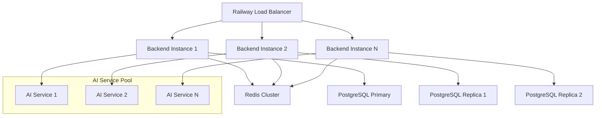
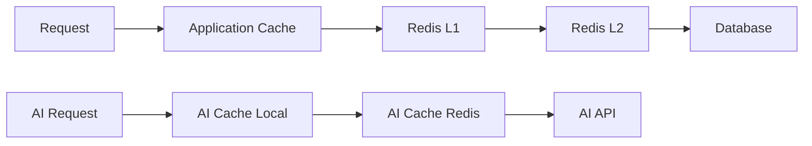

# VoteLens AI - Scaling Architecture for Railway Production

## Executive Summary

VoteLens AI requires a scalable architecture to handle election data processing, AI analytics, and concurrent user loads. This document outlines the horizontal scaling strategy, stateless design patterns, and optimization recommendations for Railway deployment.

---

## Table of Contents

1. [Current Architecture Analysis](#current-architecture-analysis)
2. [Horizontal Scaling Strategy](#horizontal-scaling-strategy)
3. [Stateless Backend Architecture](#stateless-backend-architecture)
4. [Database Scaling Strategy](#database-scaling-strategy)
5. [Caching Architecture](#caching-architecture)
6. [AI Service Scaling](#ai-service-scaling)
7. [Monitoring & Observability](#monitoring--observability)
8. [Deployment Strategy](#deployment-strategy)

---

## Current Architecture Analysis

### Strengths
- **Modular Design**: Clear separation of concerns with dedicated services
- **Existing Caching**: AI cache service with Redis support
- **Database Optimization**: Comprehensive query optimization service
- **Error Handling**: Robust error handling and retry mechanisms

### Scaling Bottlenecks
- **Stateful Components**: Local cache instances in AI service
- **Database Connections**: Limited connection pooling
- **AI Rate Limits**: Single API key usage
- **Memory Usage**: In-memory caching without proper eviction

---

## Horizontal Scaling Strategy

### 1. Application Layer Scaling



### 2. Scaling Configuration

#### Railway Service Configuration
```json
{
  "services": {
    "backend": {
      "scaling": {
        "min_instances": 2,
        "max_instances": 10,
        "target_cpu": 70,
        "target_memory": 80
      }
    }
  }
}
```

#### Auto-scaling Triggers
- **CPU Usage**: Scale up when >70% for 5 minutes
- **Memory Usage**: Scale up when >80% for 3 minutes
- **Response Time**: Scale up when p95 > 2s
- **Queue Depth**: Scale up when job queue > 100

---

## Stateless Backend Architecture

### 1. Session Management

**Current**: Firebase Auth with local session storage
**Optimized**: JWT tokens with Redis session store

```typescript
// Session service for stateless authentication
export class SessionService {
  private redis: Redis;
  
  async createSession(userId: string, tokens: any): Promise<string> {
    const sessionId = crypto.randomUUID();
    await this.redis.setex(
      `session:${sessionId}`, 
      86400, // 24 hours
      JSON.stringify({ userId, tokens })
    );
    return sessionId;
  }
  
  async validateSession(sessionId: string): Promise<any> {
    const session = await this.redis.get(`session:${sessionId}`);
    if (!session) throw new Error('Invalid session');
    return JSON.parse(session);
  }
}
```

### 2. File Storage Statelessness

**Current**: Local file uploads
**Optimized**: Cloudflare R2 for distributed storage

```typescript
// Stateless file service
export class FileService {
  private r2Client: R2Client;
  
  async uploadFile(file: Buffer, key: string): Promise<string> {
    await this.r2Client.put({
      Bucket: process.env.R2_BUCKET,
      Key: key,
      Body: file
    });
    
    return `https://pub-${process.env.R2_ACCOUNT_ID}.r2.dev/${key}`;
  }
}
```

### 3. Cache Statelessness

**Current**: Local Map-based caching
**Optimized**: Redis cluster with consistent hashing

```typescript
// Distributed cache service
export class DistributedCacheService {
  private redisCluster: Redis[];
  private hashRing: ConsistentHash;
  
  constructor(redisNodes: string[]) {
    this.redisCluster = redisNodes.map(node => new Redis(node));
    this.hashRing = new ConsistentHash(redisNodes);
  }
  
  async get(key: string): Promise<any> {
    const node = this.hashRing.getNode(key);
    return await this.redisCluster[node].get(key);
  }
  
  async set(key: string, value: any, ttl: number): Promise<void> {
    const node = this.hashRing.getNode(key);
    await this.redisCluster[node].setex(key, ttl, JSON.stringify(value));
  }
}
```

---

## Database Scaling Strategy

### 1. Connection Pooling

#### Prisma Configuration
```typescript
// Enhanced database client
export class DatabaseService {
  private prisma: PrismaClient;
  
  constructor() {
    this.prisma = new PrismaClient({
      datasources: {
        db: {
          url: process.env.DATABASE_URL
        }
      },
      log: ['query', 'info', 'warn', 'error'],
      // Connection pooling
      __internal: {
        engine: {
          connectionLimit: 20,
          poolTimeout: 30000,
          idleTimeout: 10000
        }
      }
    });
  }
}
```

#### PgBouncer Configuration
```ini
[databases]
votelens = host=postgresql.railway.app port=5432 dbname=votelens

[pgbouncer]
listen_port = 6432
listen_addr = 0.0.0.0
auth_type = plain
auth_file = /etc/pgbouncer/userlist.txt
logfile = /var/log/pgbouncer.log
pidfile = /var/run/pgbouncer/pgbouncer.pid
admin_users = postgres
stats_users = stats, postgres

# Pool settings
pool_mode = transaction
max_client_conn = 200
default_pool_size = 20
min_pool_size = 5
reserve_pool_size = 5
reserve_pool_timeout = 5
max_db_connections = 50
max_user_connections = 50

# Timeouts
server_reset_query = DISCARD ALL
server_check_delay = 30
server_check_query = select 1
server_lifetime = 3600
server_idle_timeout = 600
```

### 2. Read Replica Strategy

```typescript
// Read replica routing
export class DatabaseRouter {
  private primary: PrismaClient;
  private replicas: PrismaClient[];
  private replicaIndex = 0;
  
  constructor() {
    this.primary = new PrismaClient({
      datasources: { db: { url: process.env.DATABASE_URL } }
    });
    
    this.replicas = [
      new PrismaClient({
        datasources: { db: { url: process.env.REPLICA_URL_1 } }
      }),
      new PrismaClient({
        datasources: { db: { url: process.env.REPLICA_URL_2 } }
      })
    ];
  }
  
  getReadReplica(): PrismaClient {
    const replica = this.replicas[this.replicaIndex];
    this.replicaIndex = (this.replicaIndex + 1) % this.replicas.length;
    return replica;
  }
  
  getPrimary(): PrismaClient {
    return this.primary;
  }
}
```

### 3. Database Optimization

#### Index Strategy
```sql
-- Critical indexes for performance
CREATE INDEX CONCURRENTLY idx_elections_status_date ON elections(status, date);
CREATE INDEX CONCURRENTLY idx_results_election_constituency ON results(election_id, constituency_id);
CREATE INDEX CONCURRENTLY idx_users_email_active ON users(email, is_active);
CREATE INDEX CONCURRENTLY idx_audit_logs_user_timestamp ON audit_logs(user_id, created_at);

-- Partial indexes for common queries
CREATE INDEX CONCURRENTLY idx_active_elections ON elections(id) WHERE status = 'ACTIVE';
CREATE INDEX CONCURRENTLY idx_recent_uploads ON uploads(id) WHERE uploaded_at > NOW() - INTERVAL '30 days';
```

#### Partitioning Strategy
```sql
-- Partition audit logs by month
CREATE TABLE audit_logs_partitioned (
    LIKE audit_logs INCLUDING ALL
) PARTITION BY RANGE (created_at);

CREATE TABLE audit_logs_2024_01 PARTITION OF audit_logs_partitioned
    FOR VALUES FROM ('2024-01-01') TO ('2024-02-01');

CREATE TABLE audit_logs_2024_02 PARTITION OF audit_logs_partitioned
    FOR VALUES FROM ('2024-02-01') TO ('2024-03-01');
```

---

## Caching Architecture

### 1. Multi-Level Caching



### 2. Cache Configuration

#### Redis Cluster Setup
```typescript
// Redis cluster configuration
export class RedisClusterService {
  private cluster: Redis;
  
  constructor() {
    this.cluster = new Redis.Cluster([
      { host: 'redis-1.railway.app', port: 6379 },
      { host: 'redis-2.railway.app', port: 6379 },
      { host: 'redis-3.railway.app', port: 6379 },
    ], {
      redisOptions: {
        password: process.env.REDIS_PASSWORD,
        connectTimeout: 10000,
        lazyConnect: true,
        maxRetriesPerRequest: 3,
        retryDelayOnFailover: 100,
      }
    });
  }
}
```

#### Cache Hierarchy
```typescript
// Cache hierarchy implementation
export class CacheHierarchy {
  private l1Cache: Map<string, any>; // Memory
  private l2Cache: Redis; // Redis
  private l3Cache: Redis; // Redis Cluster
  
  async get(key: string): Promise<any> {
    // L1: Memory cache (fastest)
    let value = this.l1Cache.get(key);
    if (value) return value;
    
    // L2: Redis instance
    value = await this.l2Cache.get(key);
    if (value) {
      this.l1Cache.set(key, value);
      return value;
    }
    
    // L3: Redis cluster (persistent)
    value = await this.l3Cache.get(key);
    if (value) {
      this.l2Cache.set(key, value, 300); // 5 minutes
      this.l1Cache.set(key, value);
      return value;
    }
    
    return null;
  }
}
```

---

## AI Service Scaling

### 1. API Key Pooling

```typescript
// AI service with multiple API keys
export class ScalableAIService {
  private apiKeys: string[];
  private keyIndex = 0;
  private rateLimiters: Map<string, RateLimiter>;
  
  constructor(apiKeys: string[]) {
    this.apiKeys = apiKeys;
    this.rateLimiters = new Map();
    
    apiKeys.forEach(key => {
      this.rateLimiters.set(key, new RateLimiter({
        tokensPerInterval: 60,
        interval: 'minute'
      }));
    });
  }
  
  private getNextApiKey(): string {
    // Round-robin with rate limit checking
    for (let i = 0; i < this.apiKeys.length; i++) {
      const key = this.apiKeys[this.keyIndex];
      const limiter = this.rateLimiters.get(key)!;
      
      if (limiter.tryRemoveTokens(1)) {
        this.keyIndex = (this.keyIndex + 1) % this.apiKeys.length;
        return key;
      }
      
      this.keyIndex = (this.keyIndex + 1) % this.apiKeys.length;
    }
    
    throw new Error('All API keys rate limited');
  }
}
```

### 2. Request Queuing

```typescript
// AI request queue with priority
export class AIRequestQueue {
  private queue: PriorityQueue<AIRequest>;
  private workers: Array<() => Promise<void>>;
  
  constructor(concurrency: number = 5) {
    this.queue = new PriorityQueue((a, b) => a.priority - b.priority);
    this.workers = Array(concurrency).fill(null).map(() => 
      this.createWorker()
    );
  }
  
  async enqueue(request: AIRequest): Promise<AIResponse> {
    return new Promise((resolve, reject) => {
      this.queue.enqueue({
        ...request,
        resolve,
        reject,
        timestamp: Date.now()
      });
    });
  }
  
  private async createWorker(): Promise<void> {
    while (true) {
      const request = await this.queue.dequeue();
      if (!request) break;
      
      try {
        const response = await this.processRequest(request);
        request.resolve(response);
      } catch (error) {
        request.reject(error);
      }
    }
  }
}
```

---

## Monitoring & Observability

### 1. Metrics Collection

```typescript
// Metrics service
export class MetricsService {
  private prometheus: Prometheus;
  
  constructor() {
    this.prometheus = new Prometheus();
    this.setupMetrics();
  }
  
  private setupMetrics() {
    // Request metrics
    this.prometheus.createCounter('http_requests_total', 'Total HTTP requests', ['method', 'route', 'status']);
    this.prometheus.createHistogram('http_request_duration', 'HTTP request duration', ['method', 'route']);
    
    // Database metrics
    this.prometheus.createCounter('db_queries_total', 'Total database queries', ['operation', 'table']);
    this.prometheus.createHistogram('db_query_duration', 'Database query duration', ['operation']);
    
    // AI metrics
    this.prometheus.createCounter('ai_requests_total', 'Total AI requests', ['model', 'status']);
    this.prometheus.createHistogram('ai_request_duration', 'AI request duration', ['model']);
    this.prometheus.createCounter('ai_tokens_used', 'Total AI tokens used', ['model']);
  }
}
```

### 2. Health Checks

```typescript
// Comprehensive health check
export class HealthCheckService {
  async checkHealth(): Promise<HealthStatus> {
    const checks = await Promise.allSettled([
      this.checkDatabase(),
      this.checkRedis(),
      this.checkAIService(),
      this.checkDiskSpace(),
      this.checkMemory()
    ]);
    
    const status = checks.every(check => check.status === 'fulfilled') ? 'healthy' : 'degraded';
    
    return {
      status,
      timestamp: new Date().toISOString(),
      checks: {
        database: checks[0].status === 'fulfilled' ? checks[0].value : { status: 'unhealthy' },
        redis: checks[1].status === 'fulfilled' ? checks[1].value : { status: 'unhealthy' },
        ai: checks[2].status === 'fulfilled' ? checks[2].value : { status: 'unhealthy' },
        disk: checks[3].status === 'fulfilled' ? checks[3].value : { status: 'unhealthy' },
        memory: checks[4].status === 'fulfilled' ? checks[4].value : { status: 'unhealthy' }
      }
    };
  }
}
```

---

## Deployment Strategy

### 1. Blue-Green Deployment

```yaml
# Railway deployment configuration
version: "1"
services:
  backend-blue:
    source: backend
    environment:
      NODE_ENV: production
      DEPLOYMENT_COLOR: blue
    healthcheck:
      path: /health
      grace_period: 30
      
  backend-green:
    source: backend
    environment:
      NODE_ENV: production
      DEPLOYMENT_COLOR: green
    healthcheck:
      path: /health
      grace_period: 30
```

### 2. Database Migration Strategy

```typescript
// Zero-downtime migration
export class MigrationService {
  async migrate(): Promise<void> {
    // 1. Run pre-migration checks
    await this.preMigrationChecks();
    
    // 2. Create new tables/indexes
    await this.createMigrationArtifacts();
    
    // 3. Backfill data in batches
    await this.backfillData();
    
    // 4. Switch application to new schema
    await this.switchSchema();
    
    // 5. Clean up old artifacts
    await this.cleanup();
  }
}
```

### 3. Scaling Triggers

```typescript
// Auto-scaling service
export class AutoScalingService {
  private metrics: MetricsService;
  private railway: RailwayAPI;
  
  async evaluateScaling(): Promise<void> {
    const metrics = await this.getMetrics();
    const currentInstances = await this.getCurrentInstanceCount();
    
    if (this.shouldScaleUp(metrics, currentInstances)) {
      await this.scaleUp(currentInstances + 1);
    } else if (this.shouldScaleDown(metrics, currentInstances)) {
      await this.scaleDown(currentInstances - 1);
    }
  }
  
  private shouldScaleUp(metrics: any, instances: number): boolean {
    return (
      metrics.cpu > 70 ||
      metrics.memory > 80 ||
      metrics.responseTime > 2000 ||
      metrics.queueDepth > 100
    ) && instances < 10;
  }
}
```

---

## Performance Targets

### Response Time SLAs
- **API Endpoints**: <200ms (p95)
- **AI Requests**: <5s (p95)
- **Database Queries**: <100ms (p95)
- **Cache Hits**: <10ms (p95)

### Throughput Targets
- **Concurrent Users**: 10,000
- **Requests/Second**: 1,000
- **AI Requests/Minute**: 500
- **Database Connections**: 200

### Availability Targets
- **Uptime**: 99.9%
- **Error Rate**: <0.1%
- **Cache Hit Rate**: >90%

---

## Implementation Roadmap

### Phase 1: Foundation (Weeks 1-2)
- [ ] Implement Redis clustering
- [ ] Set up connection pooling
- [ ] Deploy monitoring stack
- [ ] Configure health checks

### Phase 2: Scaling (Weeks 3-4)
- [ ] Implement auto-scaling
- [ ] Set up read replicas
- [ ] Optimize database indexes
- [ ] Deploy AI service pool

### Phase 3: Optimization (Weeks 5-6)
- [ ] Fine-tune caching strategy
- [ ] Implement request queuing
- [ ] Optimize AI service
- [ ] Performance testing

### Phase 4: Production (Weeks 7-8)
- [ ] Blue-green deployment
- [ ] Load testing
- [ ] Documentation
- [ ] Monitoring alerts

---

## Conclusion

This scaling architecture provides VoteLens AI with the foundation to handle production workloads while maintaining performance and reliability. The combination of horizontal scaling, stateless design, and comprehensive caching ensures the application can scale to meet growing demand.

The implementation roadmap provides a structured approach to deploying these optimizations, with clear phases and measurable targets. Regular monitoring and performance testing will ensure the architecture continues to meet the evolving needs of the application.
